# Episode 1: Getting Started with Your First Azure Synapse Project

## Table of Contents

- [Episode 1: Getting Started with Your First Azure Synapse Project](#episode-1-getting-started-with-your-first-azure-synapse-project)
  - [Table of Contents](#table-of-contents)
  - [Introduction](#introduction)
  - [Task 1: Locate the Documentation](#task-1-locate-the-documentation)
  - [Task 2: Create a Synapse Workspace](#task-2-create-a-synapse-workspace)
  - [Task 3: Introduction to Synapse Studio](#task-3-introduction-to-synapse-studio)
  - [Task 4: Explore the Knowledge Center and load a sample](#task-4-explore-the-knowledge-center-and-load-a-sample)
  - [Task 5: Working With Spark Pools](#task-5-working-with-spark-pools)
  - [Task 6: Adding an Administrator](#task-6-adding-an-administrator)
  - [Task 7: Conclusion](#task-7-conclusion)

## Introduction

Azure Synapse Analytics is an enterprise-grade analytics service and a one-stop-shop for all your analytical processing needs. Azure Synapse Analytics combines enterprise data warehousing, industry-leading SQL (both serverless and dedicated), Spark technologies, ETL/ELT pipelines, and deep integrations with other Azure services such as Power BI, Cosmos DB, and Azure ML. All of these integrations and capabilities are made available via a single user interface, Synapse Studio. In this article, we will review how to get started with your first Azure Synapse project.

## Task 1: Locate the Documentation

Azure Synapse Analytics experiences regular updates, enhancements, and new features. Therefore, it is critical to know the location of current documentation to obtain guidance on the use of the service and to stay informed of the latest design principles and best practices. In this task, we will review where to locate the documentation for Azure Synapse Analytics.

1. To learn more about Azure Synapse Analytics' capabilities, refer to the [documentation.](aka.ms/SynapseDocs) Particularly, new users should consult the [Quickstarts](https://docs.microsoft.com/en-us/azure/synapse-analytics/get-started) to build their knowledge regarding common tasks in Synapse.

## Task 2: Create a Synapse Workspace

The first step to begin an Azure Synapse Analytics project is establishing an Azure Synapse Analytics workspace resource. This workspace represents the Azure Synapse Analytics instance's identity and is considered the entry point to environment administration and security management. In addition, a link to the workspace web-based user interface, Synapse Studio, can also be found within the Azure Synapse Analytics workspace resource.

In this task, you will use the Azure Portal to create an Azure Synapse Analytics workspace resource.

1. Open the [Azure portal](portal.azure.com) and select **Create a resource**. Search for and select **Azure Synapse Analytics**. Select **Create**.

    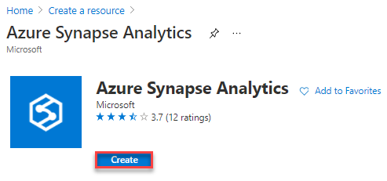

2. The **Create Synapse workspace** page opens. Provide the following details.
  
   - **Subscription** (1) -- select an Azure subscription that you have access to
   - **Resource group** (2) -- if you have not created a resource group for this lab, select **Create new** and create a resource group with a descriptive name
   - **Managed resource group** (3) -- feel free to keep this empty. The managed resource group contains resources that support the Synapse Workspace
   - **Workspace name** (4) -- provide a descriptive name compatible with Azure's name requirements (including global uniqueness)
   - **Region** (5) -- choose a region near you
   - **Select Data Lake Storage Gen2** (6) -- select **From subscription**
   - **Account name** (7) -- select **Create new** and provide a unique ADLS Gen2 account name
   - **File system name** (8) -- select **Create new** and provide the name **users** to indicate that users of the Synapse Workspace can store their assets in the file system

    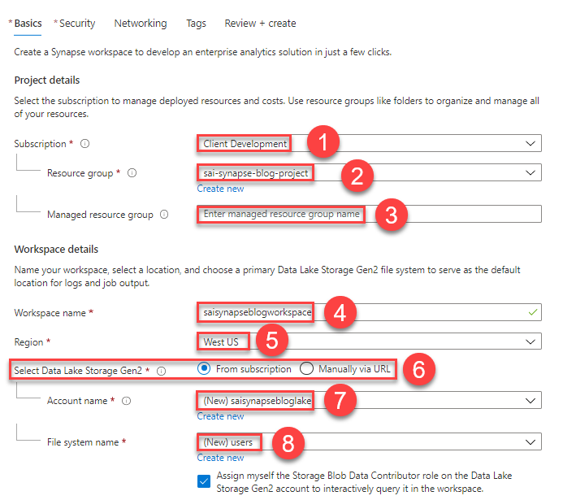

3. You may notice that Azure assigns your user account the `Storage Blob Data Contributor` role over the Data Lake Storage Gen2 account that you create. This gives your account access over all containers in the account. You will also see an information box that notifies you that a Managed System Identity allows the workspace entity to access the Data Lake Storage Gen2 account. This is useful for automation with pipelines. Remember that data needs to be secured at every level of the system, including storage in the Data Lake. If more granular permissions are required, [POSIX-style access control lists](https://docs.microsoft.com/en-us/azure/storage/blobs/data-lake-storage-access-control) in conjunction with Azure RBAC (role-based access control) are able to be set at both the directory and file level.

    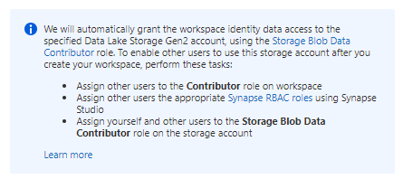

4. Navigate to the next tab, **Security**. You will see an area to provide **SQL administrator credentials**. Microsoft advises customers to avoid providing a **SQL Password**.

5. Navigate to **Networking**. This tab sets firewall rules and virtual network integration.

6. Select the **Review + create** tab. Once validation passes, select **Create** at the lower left-hand corner of the page.

    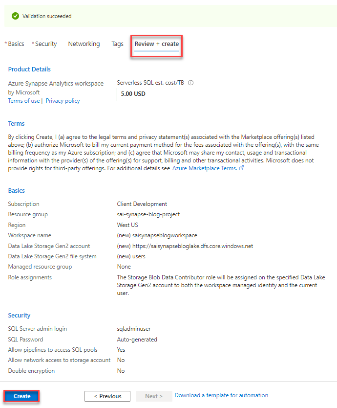

## Task 3: Introduction to Synapse Studio

Synapse Studio provides a powerful user interface into the world of Azure Synapse Analytics. Synapse Studio enables members from multiple data-related roles to collaborate. The dba, developer, BI, and data scientists can perform their jobs using a single interface. The Synapse Studio interface provides functionality split between multiple activity hubs.

Let's take a moment now to open Synapse Studio and explore the interface.

We'll begin by accessing Synapse Studio through the newly deployed Synapse workspace resource.

1. Once the resource provisioning completes, navigate to your Synapse workspace. On the **Overview** page, take note of the following. Then, launch Synapse Studio.

    - **Serverless SQL pools** (1) -- With Serverless SQL pools, billing occurs according to use. It is a powerful distributed SQL execution tool. A pool called *Built-in* exists in every workspace
    - **Apache Spark pools** (2)
    - A link to Synapse Studio (3), where most day-to-day work occurs (pipeline development, notebook development, etc.)

    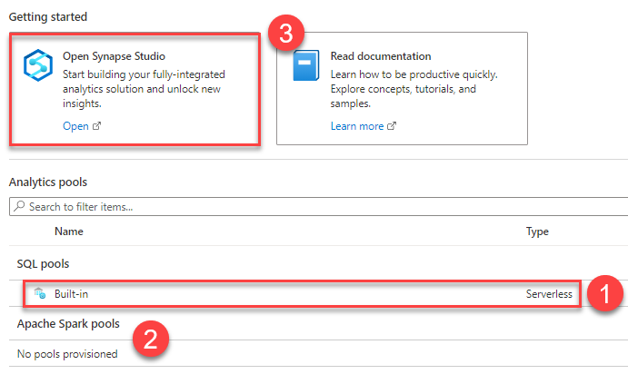

2. In Synapse Studio, be aware of the following controls in the upper right-hand corner of the page:

    - **Release notes/updates** (1)
    - **Workspace + subscription** (2)
    - Resources (including the **Knowledge Center**) (3)
    - **Feedback** (4)

    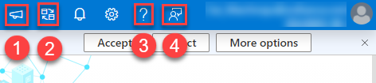

3. Take a moment now to explore each of the activity hubs in Synapse Studio.

   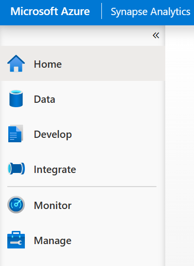

    - The **Home hub** provides quick links to everyday tasks, recent documents, and pinned assets. - The Data hub contains all workspace databases (SQL and Spark), linked data stores (such as Cosmos DB and ADLS Gen 2), and integration dataset definitions.

    - The **Develop hub** contains programming assets, including SQL scripts, Spark job definitions, notebooks, data flows, and Power BI reports.

    - The **Integrate hub** houses data pipelines consisting of one or more activities, such as copy data, stored procedure, notebook, and data flow activities.

    - The **Monitor hub** is a comprehensive dashboard where you can find health details of environment infrastructure, view the performance details of pipeline runs, SQL queries, and more.

    - The **Manage** hub provides the ability to secure the environment, connect to source control, and create SQL and Spark pools. In addition, the Manage hub is where to define linked services and pause and resume dedicated SQL pools.

## Task 4: Explore the Knowledge Center and load a sample

The Knowledge Center is a one-stop-shop to kickstart your learning on data warehousing concepts. Within Knowledge Center, you will find multiple self-service scenarios to learn new concepts or get a head start on common development tasks. Here you will find sample scripts, notebooks, pipeline templates, and the ability to load, query, and leverage Azure Open Datasets in your project.

1. Navigate to the **Knowledge Center** in the upper right-hand corner menu. This area contains resources to support new and advanced users of Azure Synapse Analytics.

2. Once the **Knowledge center** opens, select **Browse gallery**.

3. Select the **Datasets** tab to locate Azure datasets that are conveniently available for your use. Enter a sample search query, like **taxi**.

    

4. Explore the **Notebooks** tab to see more complete solutions involving Synapse. Note that the same concepts are discussed in multiple different languages (such as Spark.NET or PySpark).

5. Reference the **SQL scripts** tab to see advanced uses of SQL queries, such as protecting data using Dynamic Data Masking.

6. Lastly, reference the **Pipelines** tab to understand pipeline templates and how to source data from a diverse array of technologies.

7. Return to the **Knowledge center**. Select **Use samples immediately**.

8. Notice that there are only three sample scenarios. The first leverages Apache Spark; the second utilizes the aforementioned serverless SQL pool; and the third uses a *dedicated* SQL pool or the *Built-in* serverless pool to create a table with SQL.

    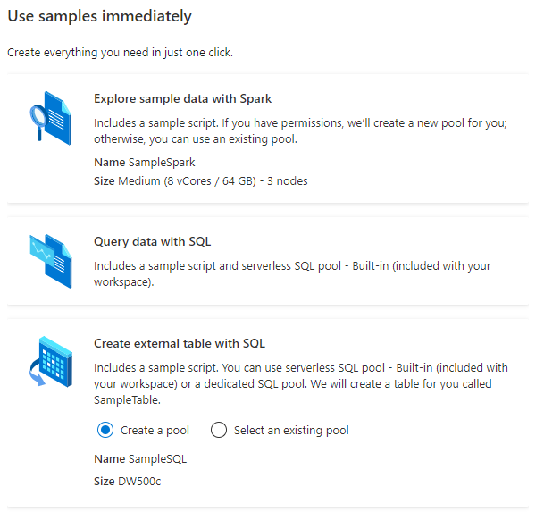

9. Select **Query data with SQL**. Then, select **Use sample**. A SQL script will open in the window. We will examine the script and the Synapse Analytics SQL development experience in the next task.

10. Observe the following functions of the SQL editor that opens after selecting the **Query data with SQL** sample.

    - **Run** button (1): This not only supports executing the entire SQL script, but also executing a portion of a script that is selected
    - **Publish** button (2): This persists your changes
    - **Connect to** dropdown (3): This indicates which pool is utilized by the script
    - **Use database** dropdown (4): This indicates the database context for the script

    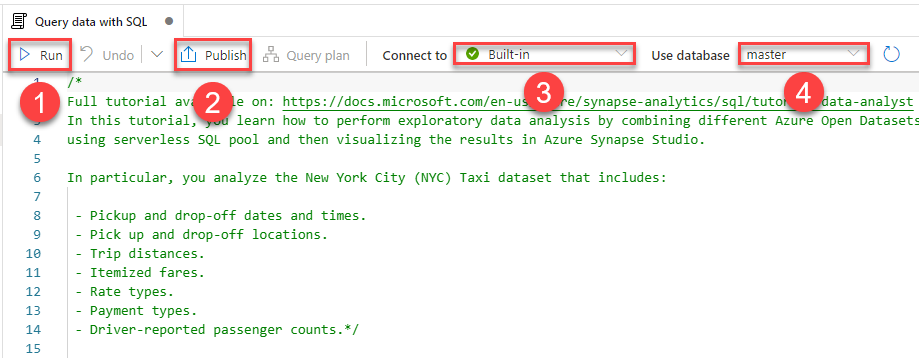

11. Observe the first query in the file, attached below. Notice the following characteristics of this query:

    ```sql
    SELECT TOP 100 * FROM
    OPENROWSET(
        BULK 'https://azureopendatastorage.blob.core.windows.net/nyctlc/yellow/puYear=2019/puMonth=*/*.parquet',
        FORMAT='PARQUET'
    ) AS [nyc];
    ```

    - The referenced Blob Storage account is not the one linked to the workspace -- it is a public account
    - The `OPENROWSET()` function does not specify a particular file -- it specifies a group of Parquet files
    - Data can be queried without creating a table in the linked Data Lake

12. Highlight the query above in the Synapse Workspace SQL editor (1). Select **Run** (2). Observe the query timing (3). In this case, 15 seconds was required for Azure to allocate compute resources to this task. Notice that subsequent queries will usually run shorter.

    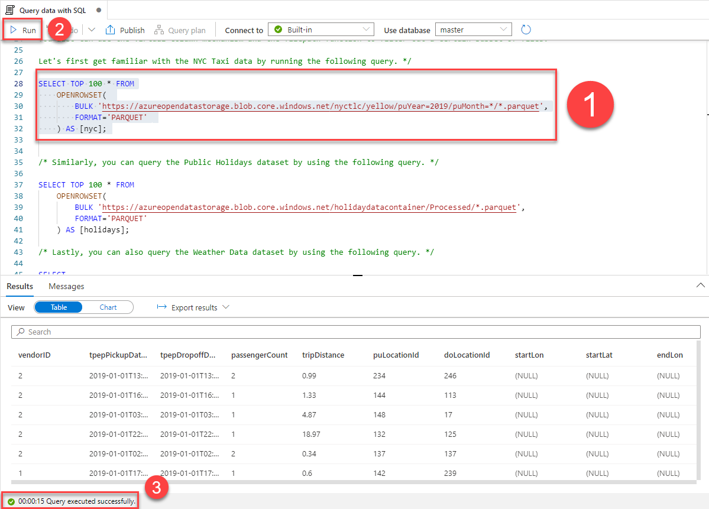

13. Now that you understand the basics of development in Azure Synapse Analytics, we will explore the power of the Apache Spark integration in the next Task.

## Task 5: Working With Spark Pools

1. Return to the **Knowledge center** and select **Use samples immediately**. Select **Explore sample data with Spark**. Finally, select **Use sample**.

2. Notice that the sample opens as a *Notebook*. However, there are some similarities to the SQL script editor, such as the need to bind the notebook to a resource (in this case, the *SampleSpark* cluster deployed in the sample). However, you must also ensure that the notebook *Language* is set correctly (2). Lastly, note that a billable Spark session has not started, as Apache Spark pools also follow the serverless model.

    

3. Select **Run all** in the upper left-hand corner of the notebook. Just like the Serverless SQL pool, Azure locates Spark cluster nodes to serve the new session. This takes roughly two minutes. The Spark cluster will exist for the lifetime of the session, until its inactivity timeout limit is met. During the lifetime of the session, you are billed.

4. Note the completion messages that are returned as the cells complete. This sample uses NYC cab data from Azure Open Datasets, analyzes the data, and displays it.

    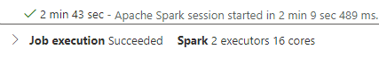

5. Once all cells have finished execution, feel free to stop the session to reduce costs. Locate this button in the upper right-hand corner of the page.

    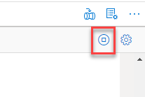

Now that you understand the power of serverless Apache Spark pools, we will explore an important administrative function of Azure Synapse Analytics: user and role configuration.

## Task 6: Adding an Administrator

1. Controlling access in Azure Synapse Analytics requires configuring Azure resource-level RBAC and Workspace-level access management (Workspace RBAC). Start by navigating to the [Azure portal](portal.azure.com) and selecting the Synapse workspace resource. Then, select **Access control (IAM)**.

    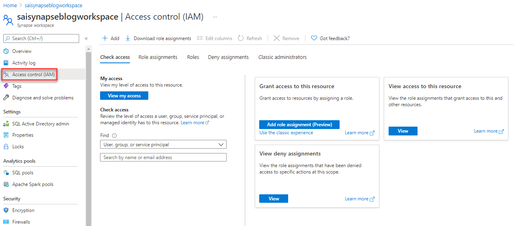

2. Select **Add** in the upper left-hand corner of the page. Select **Add role assignment**.

3. On the **Add role assignment** form, select **Owner** as the **Role** (1). Then, search for another individual in your organization to whom you would like to grant access to your workspace (2). Lastly, select **Save** (3). Owners can create Synapse pools.

    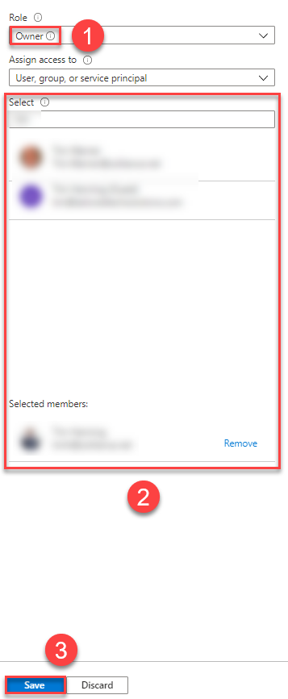

4. Return to Synapse Studio. Then, select the **Manage** hub (1) and the **Access control** tab (2).

    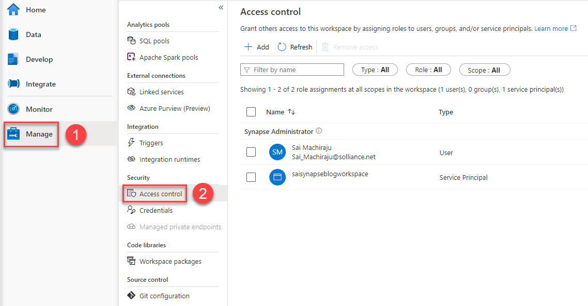

5. Select **Add** (1). Then, select **Workspace** as the **Scope** (2), as we will be configuring an administrative user. Select **Synapse Administrator** as the **Role** (3). Select the user you wish to grant access to in the **Select user** search field (4). Lastly, select **Apply** (5).

    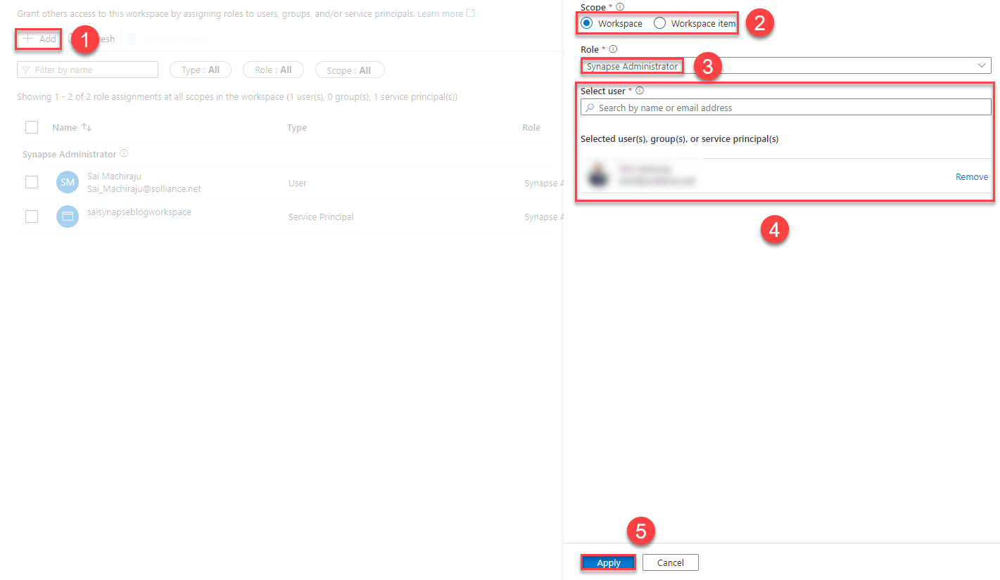

6. In the current state, the added user cannot read or write files in the linked Data Lake. To remedy this, navigate to the Azure Data Lake Storage Gen2 account linked with your Synapse Workspace. Navigate to the **Access Control (IAM)** tab.

7. As shown previously, add a role assignment. Use **Storage Blob Data Contributor** as the **Role** (1). Select the correct user (2). Then, **Save** the new role assignment (3).
    
    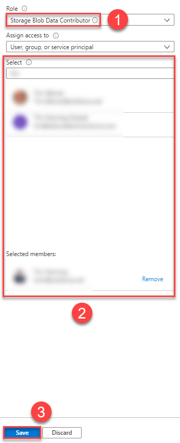

    >**Note**: This role assignment gives the administrative user access to the data contained within the storage account. We will configure resource-level management in the next step.

8. Initiate another role assignment with the same user. However, assign the user the **Owner** role.

    >**Note**: You can provide more granular role assignments using POSIX ACLs. However, assigning the **Owner** and **Storage Blob Data Contributor** roles over the storage account is an excellent place to start to add an administrative user.

You have now completed the configuration for a new administrative user to manage all capabilities of a Synapse Workspace and supporting resources.

## Task 7: Conclusion

Congratulations. You have configured a basic development and testing environment for your Synapse workloads. To further your understanding of Azure Synapse Analytics, consult the Knowledge center and the [Microsoft documentation.](docs.microsoft.com)
