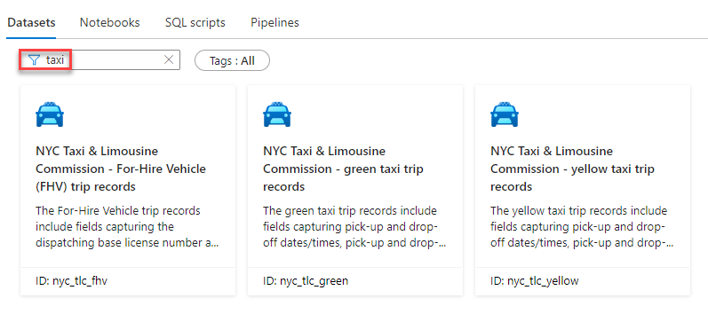
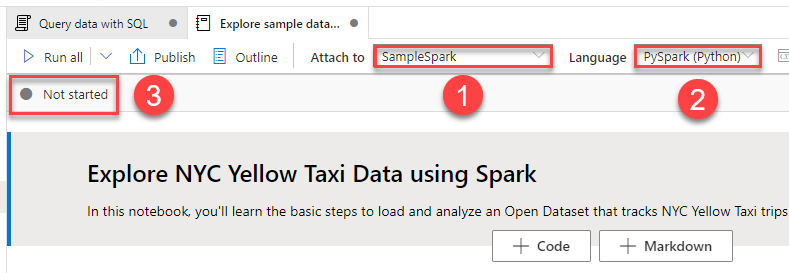

# Episode 1: Getting Started with Your First Azure Synapse Project

## Table of Contents (TODO)

## Task 1: Locate the Documentation

1. To learn more about Azure Synapse Analytics' capabilities, refer to the [documentation.](aka.ms/SynapseDocs) Particularly, new users should consult the [Quickstarts](https://docs.microsoft.com/en-us/azure/synapse-analytics/get-started) to build their knowledge regarding common tasks in Synapse.

## Task 2: Create a Synapse Workspace

1. Open the [Azure portal](portal.azure.com) and select **Create a resource**. Search for and select **Azure Synapse Analytics**. Select **Create**.

    

2. The **Create Synapse workspace** page opens. Provide the following details.
  
   - **Subscription** (1) -- select an Azure subscription that you have access to
   - **Resource group** (2) -- if you have not created a resource group for this lab, select **Create new** and create a resource group with a descriptive name
   - **Managed resource group** (3) -- feel free to keep this empty. The managed resource group contains resources that support the Synapse Workspace
   - **Workspace name** (4) -- provide a descriptive name compatible with Azure's name requirements (including global uniqueness)
   - **Region** (5) -- choose a region near you
   - **Select Data Lake Storage Gen2** (6) -- select **From subscription**
   - **Account name** (7) -- select **Create new** and provide a unique ADLS Gen2 account name
   - **File system name** (8) -- select **Create new** and provide the name **users** to indicate that users of the Synapse Workspace can store their assets in the file system

    

3. You may notice that Azure assigns your user account the `Storage Blob Data Contributor` role over the Data Lake Storage Gen2 account that you create. This gives your account access over all containers in the account. You will also see an information box that notifies you that a Managed System Identity allows the workspace entity to access the Data Lake Storage Gen2 account. This is useful for automation with pipelines. 

    

4. Navigate to the next tab, **Security**. You will see an area to provide **SQL administrator credentials**. Microsoft advises customers to avoid providing a **SQL Password**.

5. Navigate to **Networking**. This tab sets firewall rules and virtual network integration.

6. Select the **Review + create** tab. Once validation passes, select **Create** at the lower left-hand corner of the page.

    

## Task 3: Introduction to Synapse Studio

1. Once the resource provisioning completes, navigate to your Synapse workspace. On the **Overview** page, take note of the following. Then, launch Synapse Studio.

    - **Serverless SQL pools** (1) -- With Serverless SQL pools, billing occurs according to use. It is a powerful distributed SQL execution tool. A pool called *Built-in* exists in every workspace
    - **Apache Spark pools** (2)
    - A link to Synapse Studio (3), where most day-to-day work occurs (pipeline development, notebook development, etc.)

    

2. In Synapse Studio, be aware of the following controls in the upper right-hand corner of the page:

    - **Release notes/updates** (1)
    - **Workspace + subscription** (2)
    - Resources (including the **Knowledge Center**) (3)
    - **Feedback** (4)

    

3. Now, navigate to the **Knowledge Center** (refer to the previous step). This area contains resources to support new and advanced users of Azure Synapse Analytics. 

4. Once the **Knowledge center** opens, select **Browse gallery**.

5. Select the **Datasets** tab to locate Azure datasets that are conveniently available for your use. Enter a sample search query, like **taxi**.

    

6. Explore the **Notebooks** tab to see more complete solutions involving Synapse. Note that the same concepts are discussed in multiple different languages (such as Spark.NET or PySpark).

7. Reference the **SQL scripts** tab to see advanced uses of SQL queries, such as protecting data using Dynamic Data Masking.

8. Lastly, reference the **Pipelines** tab to understand pipeline templates and how to source data from a diverse array of technologies.

9. Return to the **Knowledge center**. Select **Use samples immediately**.

10. Notice that there are only three sample scenarios. The first leverages Apache Spark; the second utilizes the aforementioned serverless SQL pool; and the third uses a *dedicated* SQL pool or the *Built-in* serverless pool to create a table with SQL.

    

11. Select **Query data with SQL**. Then, select **Use sample**. A SQL script will open in the window. We will examine the script and the Synapse Analytics SQL development experience in the next task.

## Task 4: Knowledge Center Sample

1. Observe the following functions of the SQL editor that opens after selecting the **Query data with SQL** sample.

    - **Run** button (1): This not only supports executing the entire SQL script, but also executing selections
    - **Publish** button (2): This persists your changes
    - **Connect to** dropdown (3): This indicates which pool is utilized by the script
    - **Use database** dropdown (4): This indicates the database context for the script

    

2. Observe the first query in the file, attached below. Notice the following characteristics of this query:

    ```sql
    SELECT TOP 100 * FROM
    OPENROWSET(
        BULK 'https://azureopendatastorage.blob.core.windows.net/nyctlc/yellow/puYear=2019/puMonth=*/*.parquet',
        FORMAT='PARQUET'
    ) AS [nyc];
    ```

    - The referenced Blob Storage account is not the one linked to the workspace -- it is a public account
    - The `OPENROWSET()` function does not specify a particular file -- it specifies a group of Parquet files
    - Data can be queried without creating a table in the linked Data Lake

3. Highlight the query above in the Synapse Workspace SQL editor (1). Select **Run** (2). Observe the query timing (3). In this case, 15 seconds was required for Azure to allocate compute resources to this task. Notice that subsequent queries will usually run shorter.

    

4. Now that you understand the basics of development in Azure Synapse Analytics, we will explore the power of the Apache Spark integration in the next Task.

## Task 5: Working With Spark Pools

1. Return to the **Knowledge center** and select **Use samples immediately**. Select **Explore sample data with Spark**. Finally, select **Use sample**. 

2. Notice that the sample opens as a *Notebook*. However, there are some similarities to the SQL script editor, such as the need to bind the notebook to a resource (in this case, the *SampleSpark* cluster deployed in the sample). However, you must also ensure that the notebook *Language* is set correctly (2). Lastly, note that a billable Spark session has not started, as Apache Spark pools also follow the serverless model.

    

3. Select **Run all** in the upper left-hand corner of the notebook. Just like the Serverless SQL pool, Azure locates Spark cluster nodes to serve the new session. This takes roughly two minutes. The Spark cluster will exist for the lifetime of the session, until its inactivity timeout limit is met. During the lifetime of the session, you are billed.