# Episode 2: Data Engineering with Azure Synapse Analytics

## Table of Contents

## Introduction

Data engineering encompasses a wide variety of tasks. These tasks include consolidating various structured and unstructured data into a format suitable for building analytical solutions. Data engineers use tools and languages available in Azure Synapse Analytics to explore data, design data storage, build pipelines and transformations, secure data, and ensure compliance. Data engineering also entails monitoring data workloads to identify failures and improve performance.

In this episode, you'll familiarize yourself with Azure Synapse Analytics while creating a data pipeline with data transformations to provide data into an analytics-ready queryable format.

## Task 1: Create a new Storage Account

We will create a simple pipeline with the Copy Data activity to copy data from a storage account to the Data Lake Storage Gen2 account linked to your Synapse Workspace in the following Tasks. We will start by creating a new Storage Account.

1. Navigate to the [Azure portal](portal.azure.com) and select **Create a resource**. Search for **Storage account** and select **Create**.

2. On the **Basics** tab of the **Create a storage account** page, provide the following parameters. Then, select **Review + create**.

    - **Subscription**: Use the same subscription that you provisioned your Workspace in
    - **Resource group**: Use the same resource group that you provisioned your Workspace in
    - **Storage account name**: Use a descriptive name, like `linkedblobstorage[SUFFIX]`
    - **Region**: Same as your Synapse Workspace
    - **Performance**: `Standard` will suffice
    - **Redundancy**: `Locally-redundant storage (LRS)` will suffice

    

3. Once validation passes, select **Create**.

4. Once the Storage Account provisions, select **Containers** below **Data storage**.

    

5. In the **New container** pane, enter `coviddata` as the name. Select **Create**.

6. Select the `coviddata` container and select **Upload** (1). Save locally and upload the [COVID-19 sample data](https://pandemicdatalake.blob.core.windows.net/public/curated/covid-19/bing_covid-19_data/latest/bing_covid-19_data.csv) (2). Then, select **Upload** (3).

    

    >**Note**: Due to the size of this file, it may take a few minutes to upload. The data in this ???

You have finished setting up the Storage Account. Now, you will create a *linked service* in Azure Synapse Analytics.

## Task 2: Working with Linked Services

A linked service defines the connection information for a resource, such as a storage account. In addition, it describes how to connect to data.

1. In your Synapse Workspace, select the **Manage** hub (1) and select **Linked services** (2). Select **+ New** (3).

    

2. In the **New linked service** window, search for and select **Azure Blob Storage**.

3. In the **New linked service (Azure Blob Storage)** window, provide the following parameters. Then, select **Create**.

    - **Name**: Use a descriptive name, like `linkedcovidstorageaccount`
    - **Authentication method**: Use `Account key`, though note the other, more secure options available
    - **Account selection method**: Select `From Azure subscription`
      - Provide the correct **Azure subscription** and the **Storage account name** of the storage account you just created

    

As you created the linked service, note that you could specify the *integration runtime* to use. This allows you to dictate where compute resources are located to move data from a variety of sources. For example, instead of the default, cloud-hosted integration runtime, you can use a self-hosted integration runtime to move on-premises CSV data to the linked Azure Data Lake Storage Gen2 account.

## Task 3: Develop a Pipeline to Orchestrate Data Engineering Tasks

In this Task, we will leverage the Copy Data tool wizard to create a pipeline with a Copy data activity. This will allow us to explore the debugging and execution strategies available to data engineers through pipelines.

1. Navigate to the **Data** hub (1) and select the **Linked** tab (2). Expand **Azure Data Lake Storage Gen2** (3) and select the **users** container (4).

   

2. Create a new folder and title it something descriptive, such as `CovidDataOutput`. This folder will be the sink for the Copy Data activity.

3. Navigate to the **Integrate** hub (1) and select the **Copy Data tool** (2). A wizard opens to create a *Copy Data Activity* orchestrated through a *pipeline*.

    

4. On the **Properties** tab, select **Built-in copy task**. Then, select **Run once now**. Select **Next**.

    

    >**Note**: The **Schedule** and **Tumbling window** options are trigger types, more on that in the next Task.

5. For the **Source data store** tab, provide the following information. Then, select **Next**.

    - **Source type**: Select `Azure Blob Storage`
    - **Connection**: Choose the linked service you created earlier
    - **File or folder**: Select **Browse**
      - Choose the `coviddata` path and select **OK**
    - Select **Binary copy** to copy the data as-is (no rigid schemas enforced)
      - Set **Compression type** to **None**
    - Select **Recursively** to enable recursive copying (though it is not applicable in this sample)

    

6. For the **Destination data store** tab, provide the following information. Select **Next**.

    - **Target type**: Select `Azure Data Lake Storage Gen2`
    - **Connection**: Choose the linked service that appears
    - **Folder path**: Select **Browse**
      - Choose `users/CovidDataOutput` and select **OK**

    

7. On the **Settings** tab, provide the following information and select **Next**.

    - **Task name**: Provide something descriptive, such as `CovidDataCopyPipeline`. This value is also used as the pipeline name

    

8. On the **Summary** tab, observe the Copy Data activity summary. In particular, note the references to source and destination datasets. Validate the summary, then select **Next**.

    

9. On the next tab, Synapse will publish the two datasets and the pipeline. It will also execute the pipeline. Once execution completes, observe the published assets by selecting **Edit Pipeline**.

    

In the subsequent Tasks, we will explore the assets produced by the Copy Data wizard. We will also discuss Data Flows and the control flow mechanisms available.

On a separate note, developers often use version control tools and CI/CD to test and deploy production builds of a product faster. Synapse provides a similar feature through the **Git configuration** functionality accessible in the **Manage** hub. Leveraging this feature means that Workspace assets are stored as JSON files in the linked repository allowing data engineers to move their data assets between environments reliably.

## Task 4: Explore the Copy Data Activity

1. Once the pipeline opens in the **Integrate** hub, select the **Copy data** activity.

    

2. Observe the **Source** tab. Notice the reference to the source dataset. In this case, it is a binary dataset, meaning that it does not model the schema of the file(s) it represents. Notice the use of a wildcard path; this matches all files in the `coviddata` container; thus, we’ll be moving all the files. You are not required to define a specific file to move in the Copy Data wizard.

    

3. The **Sink** tab references the target dataset, which is also a binary dataset.

    

4. Now that you observe the features of the Copy data activity, select **Debug** at the top of the page. The Debug functionality allows you to test your pipelines as you develop them, whereas using a trigger to orchestrate your pipeline uses the latest published configuration.

5. Once the Debug session completes, select the **Output** tab (note that you may have to deselect the Copy data activity). Note that you can visualize the input (1), the output (2), and the details of the activity (3).

    

6. Besides debugging, you can also select **Add trigger**. Select **New/Edit**. Then, in the **Choose trigger...** dropdown, select **+ New**.

7. In the **New trigger** window, note that you can provide the following trigger types. Creating a trigger is out of scope for this post.

    - **Schedule** triggers: Repeatedly execute after the specified interval (**Recurrence**), starting from the **Start date** and continuing to an optional **End date**
    - **Tumbling window** triggers: Similar to **Schedule** triggers, but consider pipeline execution status in their state (e.g., they are aware that the pipeline they are associated with is canceled or otherwise interrupted)
    - **Storage event** triggers: Fire whenever a blob is created or deleted in the specified Blob Storage container
    - **Custom event** triggers: Integrate with Azure Event Grid to fire based on a subscription to a topic

    

## Task 5: Get Started with Data Flows

1. Navigate to the `CovidDataOutput` directory that you created in Task 3, Step 2. Select the `bing_covid-19_data.csv` file that has been moved into the Data Lake from Blob Storage. Then, select **New data flow**.

    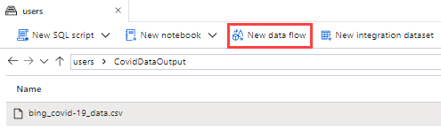

2. Before creating the Data Flow, Azure will prompt you with multiple parameters. Enter them, and then select **Create**.

    - **Data flow name**: `TransformCovidData`
    - **Integration dataset name**: `CovidCSVDataset`
    - **Format**: Select **DelimitedText**
    - **Import schema**: Select **From connection/store**

    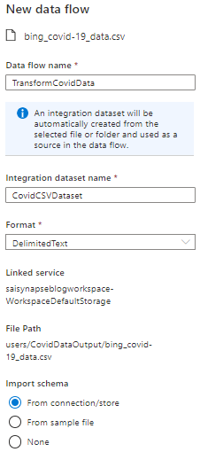

3. Once the Data Flow editor launches, select the slider for **Data flow debug**. Accept the default settings and select **OK**. Using this feature will help you visualize how the various steps of your data flow manipulate data.

4. Select the `source1` source transformation. On the **Source settings** tab (1), select **Open** next to the **Dataset** (2).

    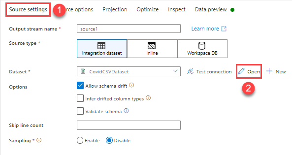

5. On the **Connection** tab of the `CovidCSVDataset` integration dataset, select **First row as header**. Return to the `TransformCovidData` Data Flow.

6. Select the `source1` source transformation again. Navigate to the **Projection** tab (1). Select **Import projection** (2).

    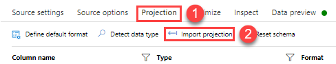

7. Note how Azure uses the Data Flow debugging cluster to populate column names and infer column types. This technology is powered by a Spark engine. For the `updated` column, set the **Format** to `yyyy-MM-dd`.

    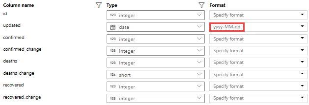

8. Navigate to the **Data preview** tab. The Data Flow debugging cluster allows you to visualize how the source transformation presents the data.

    >**Note**: You may need to select **Refresh** for accurate results to show. 

9. Note that the **Data preview** tab supports some basic analysis. Select the `country_region` column and select **Statistics**. Since the unique values of the 1,000 rows data preview are just `Worldwide` and `Afghanistan`, this column may not be useful for our data analysis.

    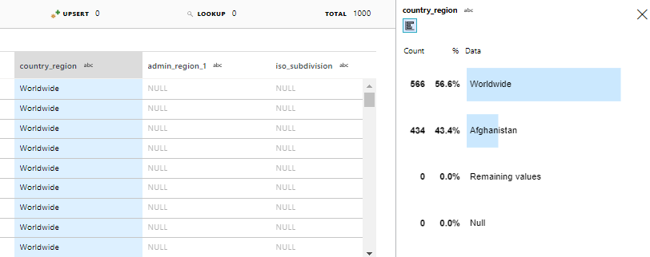

    >**Note**: It's possible to increase the data preview beyond 1,000 rows for a more comprehensive analysis of the data.

10. Select the small **+** below the source transformation. Below **Schema modifier**, select **Select**.

    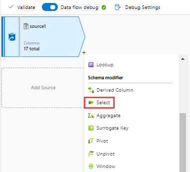

11. In the **Select settings** tab, notice how the columns from the source dataset are imported into the Select schema modifier. Delete the `id` and `load_time` columns, as they are not relevant to our analysis.

    >**Note**: To read more about what the columns of this dataset represent, read the [documentation](https://docs.microsoft.com/azure/open-datasets/dataset-bing-covid-19) for this dataset.

    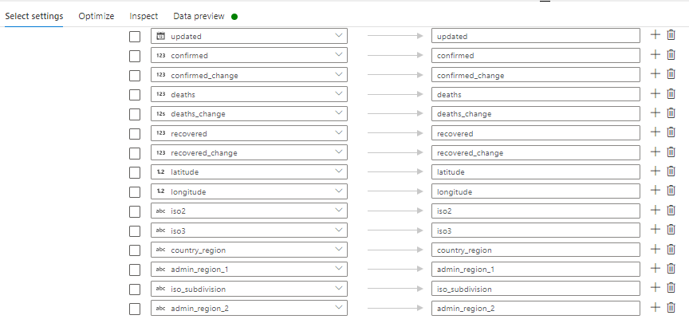

12. Select the small **+** below the column select transformation. Below **Schema modifier**, select **Aggregate**.

    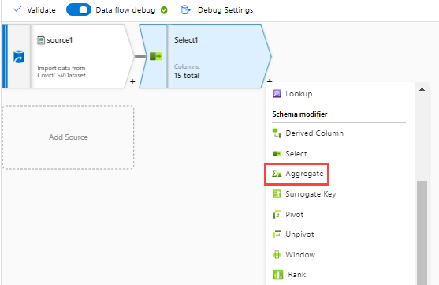

13. In the **Aggregate settings** tab, select the **Group by** switch (1). Use `updated` as the column name (2). Accept the default **Name as** value.

    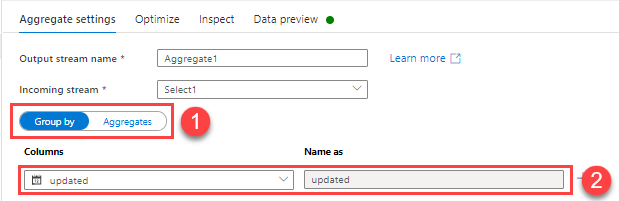

14. Select the **Aggregates** switch (1). Title the **Column** `ChangeFromYesterdayAsPercentOfToday` and set the **Expression** to `sum(confirmed_change)/sum(confirmed)` (2).

    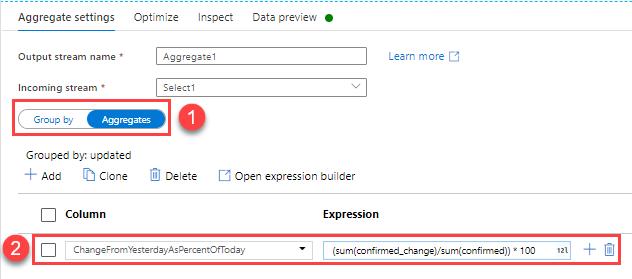