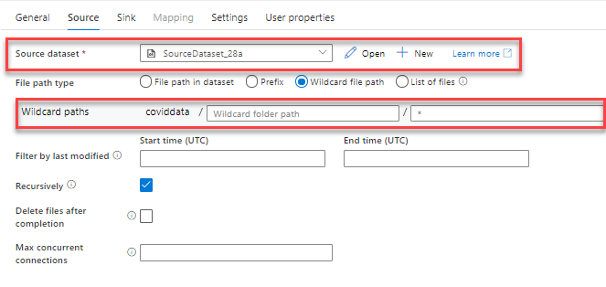

# Episode 2: Data Engineering with Azure Synapse Analytics

## Table of Contents

## Task 1: Create a new Storage Account

In the following Tasks, we will create a simple pipeline with the Copy Data activity to copy data from a storage account to the Data Lake Storage Gen2 account linked to your Synapse Workspace. We will start by creating a new Storage Account.

1. Navigate to the [Azure portal](portal.azure.com) and select **Create a resource**. Search for **Storage account** and select **Create**.

2. On the **Basics** tab of the **Create a storage account** page, provide the following parameters. Then, select **Review + create**.

    - **Subscription**: Use the same subscription that you provisioned your Workspace in
    - **Resource group**: Use the same resource group that you provisioned your Workspace in
    - **Storage account name**: Use a descriptive name, like `linkedblobstorage[SUFFIX]`
    - **Region**: Same as your Synapse Workspace
    - **Performance**: `Standard` will suffice
    - **Redundancy**: `Locally-redundant storage (LRS)` will suffice

    

3. Once validation passes, select **Create**.

4. Once the Storage Account provisions, select **Containers** below **Data storage**.

    

5. In the **New container** pane, enter `coviddata` as the name. Select **Create**.

6. Select the `coviddata` container and select **Upload** (1). Save locally and upload the [COVID-19 sample data](https://pandemicdatalake.blob.core.windows.net/public/curated/covid-19/bing_covid-19_data/latest/bing_covid-19_data.csv) (2). Then, select **Upload** (3).

    

    >**Note**: Due to the size of this file, it may take a few minutes to upload. The file was pulled directly from Azure Open Datasets.

You have finished setting up the Storage Account. Now, you will create a *linked service* in Azure Synapse Analytics.

## Task 2: Working with Linked Services

A linked service defines the connection information for a resource, such as a storage account. It defines how to connect to data.

1. In your Synapse Workspace, select the **Manage** hub (1) and select **Linked services** (2). Select **+ New** (3).

    

2. In the **New linked service** window, search for and select **Azure Blob Storage**.

3. In the **New linked service (Azure Blob Storage)** window, provide the following parameters. Then, select **Create**.

    - **Name**: Use a descriptive name, like `linkedcovidstorageaccount`
    - **Authentication method**: Use `Account key`, though note the other, more secure options available
    - **Account selection method**: Select `From Azure subscription`
      - Provide the correct **Azure subscription** and the **Storage account name** of the storage account you just created

    

As you created the linked service, note that you had the option to specify the *integration runtime* to use. This allows you dictate where compute resources are located to move data from a variety of sources. For example, instead of the default, cloud-hosted integration runtime, you can use a self-hosted integration runtime to move on-premises CSV data to the linked Azure Data Lake Storage Gen2 account.

## Task 3: Develop a Pipeline to Orchestrate Data Engineering Tasks

In this Task, we will leverage the Copy Data tool wizard to create a pipeline with a Copy data activity. This will allow us to explore the debugging and execution strategies available to data engineers through pipelines.

1. Navigate to the **Data** hub (1) and select the **Linked** tab (2). Expand **Azure Data Lake Storage Gen2** (3) and select the **users** container (4).

   

2. Create a new folder and title it something descriptive, such as `CovidDataOutput`. This will be the sink for the Copy Data activity.

3. Navigate to the **Integrate** hub (1) and select the **Copy Data tool** (2). This will open a wizard to create a *Copy Data Activity* orchestrated through a *pipeline*.

    

4. On the **Properties** tab, select **Built-in copy task**. Then, select **Run once now**. Select **Next**.

    

    >**Note**: The **Schedule** and **Tumbling window** options are trigger types which will be addressed in the next Task.

5. For the **Source data store** tab, provide the following information. Then, select **Next**.

    - **Source type**: Select `Azure Blob Storage`
    - **Connection**: Choose the linked service you created earlier
    - **File or folder**: Select **Browse**
      - Choose the `coviddata` path and select **OK**
    - Select **Binary copy** to copy the data as-is (no rigid schemas enforced)
      - Set **Compression type** to **None**
    - Select **Recursively** to enable recursive copying (though it is not applicable in this sample) 

    

6. For the **Destination data store** tab, provide the following information. Select **Next**.

    - **Target type**: Select `Azure Data Lake Storage Gen2`
    - **Connection**: Choose the linked service that appears
    - **Folder path**: Select **Browse**
      - Choose `users/CovidDataOutput` and select **OK**

    

7. On the **Settings** tab, provide the following information and select **Next**.

    - **Task name**: Provide something descriptive, such as `CovidDataCopyPipeline`. This will be used as the pipeline name

    

8. On the **Summary** tab, observe the Copy Data activity summary. In particular, note the references to source and destination datasets. Once you have validated the summary, select **Next**.

    

9. On the next tab, Synapse will publish the two datasets and the pipeline. It will also execute the pipeline. Once execution completes, observe the published assets by selecting **Edit Pipeline**.

    

In the subsequent Tasks, we will explore the assets produced by the Copy Data wizard. We will also discuss Data Flows and the control flow mechanisms available.

On a separate note, developers often use version control tools and CI/CD to test and deploy production builds of a product faster. Synapse provides a similar feature through the **Git configuration** functionality accessible in the **Manage** hub. This means that Workspace changes are stored as JSON files in the linked repository. This functionality allows data engineers to move their pipelines from development to production environments reliably.

## Task 4: Explore the Copy Data Activity

1. Once the pipeline opens in the **Integrate** hub, select the **Copy data** activity.

    

2. Observe the **Source** tab. Notice the reference to the source dataset. In this case, it is a binary dataset, meaning that it does not model the schema of the file(s) it represents. Also notice the wildcard path; this specifies that all files in the `coviddata` container should be moved. We did not define the specific file to move in the Copy Data wizard.

    

3. The **Sink** tab references the target dataset, which is also a binary dataset.

    

4. Now that you observe the features of the Copy data activity, select **Debug** at the top of the page. The Debug functionality allows you to test your pipelines as you develop them, whereas using a trigger to orchestrate your pipeline uses the latest published configuration.

5. Once the Debug session completes, select the **Output** tab (note that you may have to deselect the Copy data activity). Note that you can visualize the input (1), the output (2), and the details of the activity (3).

    

6. Besides debugging, you can also select **Add trigger**. Select **New/Edit**. Then, in the **Choose trigger...** dropdown, select **+ New**.

7. In the **New trigger** window, note that you can provide the following trigger types. Creating a trigger is out of scope for this post.

    - **Schedule** triggers: Repeatedly execute after the specified interval (**Recurrence**), starting from the **Start date** and continuing to an optional **End date**
    - **Tumbling window** triggers: Similar to **Schedule** triggers, but consider pipeline execution status in their state (e.g. they are aware if the pipeline they are associated with is cancelled or otherwise interrupted)
    - **Storage event** triggers: Fire whenever a blob is created or deleted in the specified Blob Storage container
    - **Custom event** triggers: Integrate with Azure Event Grid to fire based on a subscription to a topic

    

## Task 5: Explore Data Flows

1. 