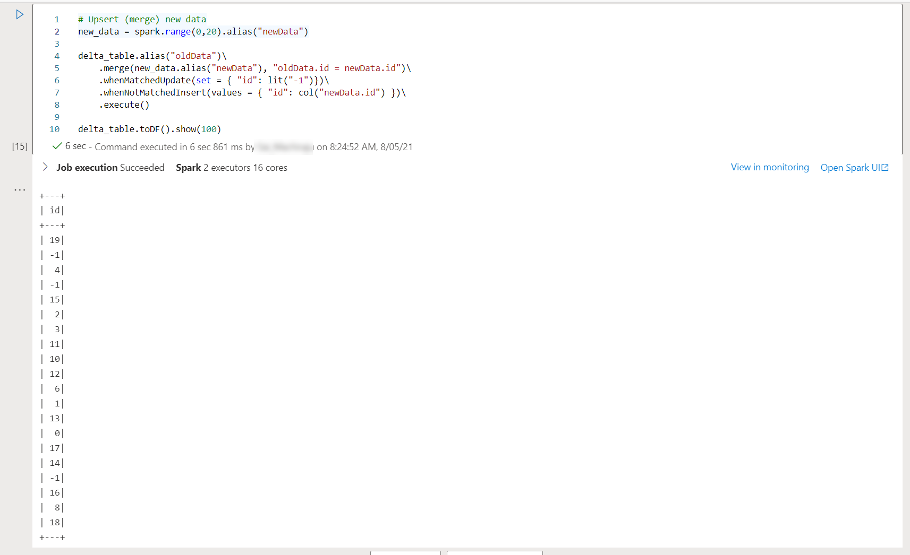

# Episode 3: Big Data and Operational Analytics

## Table of Contents

- [Episode 3: Big Data and Operational Analytics](#episode-3-big-data-and-operational-analytics)
  - [Table of Contents](#table-of-contents)
  - [Task 1: Create a new Apache Spark Pool](#task-1-create-a-new-apache-spark-pool)
  - [Task 2: Working with Apache Spark](#task-2-working-with-apache-spark)
  - [Task 3: Monitoring Apache Spark (TODO)](#task-3-monitoring-apache-spark-todo)
  - [Task 4: Column Partitions (TODO)](#task-4-column-partitions-todo)
  - [Task 5: Partition Performance (TODO)](#task-5-partition-performance-todo)
  - [Task 6: Write and Interact with Tables](#task-6-write-and-interact-with-tables)
  - [Task 7: Azure Cosmos DB HTAP Integration (TODO)](#task-7-azure-cosmos-db-htap-integration-todo)
  - [Task 8: Introducing Delta Lake](#task-8-introducing-delta-lake)
  - [Task 9: Storage in ADLS Gen2 (TODO)](#task-9-storage-in-adls-gen2-todo)
  - [Task 10: Conclusion](#task-10-conclusion)

## Task 1: Create a new Apache Spark Pool

Apache Spark is known as a powerful in-memory parallel big-data processing framework. Azure Synapse Analytics integrates Apache Spark by providing the ability to define Spark pools. A Spark pool is a metadata definition of the compute power, number of nodes, node size, properties, and configuration required to process data workloads for an organization. You have the ability to define multiple Spark pools with varying properties and configurations customized for specific data jobs. Creating a Spark pool does not incur any additional cost. Instead, you pay for the Spark resources used during a session. Azure Synapse Analytics fully manages all Spark related infrastructure. Azure Synapse Analytics will automatically provision a Spark cluster instance based on the requested Spark pool definition on-demand and will manage the de-provisioning of the Spark cluster once the session ends.

In this Task, learn the parameters to consider when defining an Apache Spark pool.

1. Launch the [Azure portal](portal.azure.com) and select your Synapse Workspace resource. Select the **Apache Spark pools** tab on the left-hand side of the page, and select **+ New** at the top of the page.

2. Provide a name for your new pool, such as **livedemo**. Take note of the following details:

    - The nodes belong to the *MemoryOptimized* SKU, which Microsoft has determined offers the best value for analytics workloads, due to its 8 GB per vCore configuration
    - You choose a node size tier from *Small*, with 4 vCores, to *XXLarge*, with 64 vCores. This provides vertical scaling capability
    - Determine whether to enable *Autoscale* or not. Enabling *Autoscale* will cause Azure to initially provision 5 nodes (in this example), but potentially expand to 10 nodes depending on the load

    

3. Navigate to the **Additional settings** tab. Again, take note of the following:

    - Enable **Automatic pausing** (1) to minimize costs during cluster idle periods (dictated by the **Number of minutes idle**)
    - Upload a custom **Spark configuration** file (2) to improve cluster versatility and performance
    - **Allow session level packages** (3) to support notebooks that require different packages than those loaded by the pool at startup

    

4. Navigate to the **Review + create** tab. Then, select **Create**.

5. **Important:** By itself, a Spark Pool is not a cluster; it is a collection of metadata that specifies the configuration of a Spark cluster provisioned or supplied by Azure Synapse Analytics on-demand.
    - Different users of the same Synapse Workspace will be allocated isolated Spark clusters for their workloads
    - Consider creating separate Spark pools for Development and Production environments or for different users
    - Multiple Spark pools may be defined in a workspace. Each pool definition may have differing configurations and properties. This can be helpful when different data workloads have different requirements.

## Task 2: Working with Apache Spark

Now that we have a Spark pool defined, we will leverage it to perform some data investigation.
While doing so, we will learn the basics of Apache Spark's data structures and how Apache Spark implements distributed processing.

1. Navigate to your Synapse Workspace and select the **Develop** hub. Create a new **Notebook**.

    

2. Select the **livedemo** Spark pool. You may have other pools from earlier tutorials.

    

3. Since Apache Spark is a distributed environment, the principal data structure is a `DataFrame`. A `DataFrame` is a tabular data structure with metadata. Add the code below to the first cell of your new notebook. It defines table data and metadata; parallelizes the data across the cluster nodes; and creates a `DataFrame`.

    ```python
    # Data and column metadata
    columns = ["database", "users_count"]
    data = [("Spark", "20000"), ("SQL", "10000"), ("CosmosDB", "3000")]

    # Parallel distribution
    rdd = sc.parallelize(data)

    # Generate a DataFrame
    sdf1 = rdd.toDF(columns)
    sdf1.printSchema()
    ```

4. Do not run the notebook cell or any subsequent notebook cells in this Task. The screenshots highlight the results of a past execution of the cells. You will run all cells at the end.

5. Paste the code below into a new cell to understand the number of partitions that support the `sdf1` DataFrame. You will see `16` once the cell runs. Use the second code example in a new cell to see the row counts per partition.

    ```python
    print(sdf1.rdd.getNumPartitions())
    ```

    ```python
    print('Data distribution: ', str(sdf1.rdd.glom().map(len).collect()))
    ```

    

6. The 16 partitions result from the number of compute cores allocated to the session (notebook). There are two executors, each of which contain 8 vCores.

    

7. Add the following two code cells. The first sample redistributes the `DataFrame` from 16 partitions to 3 partitions. The second sample visualizes the partition redistribution.

    ```python
    sdf2 = sdf1.repartition(3)
    ```

    ```python
    print('Data distribution: ', str(sdf2.rdd.glom().map(len).collect()))
    ```

    

8. As a performance enhancement, maximize the in-memory storage of the DataFrame.

    ```python
    sdf1.cache()
    ```

    >**Note:** Spark uses lazy execution, which is why caching intermediate results has benefits.

9. Persist the second DataFrame's partitions (`sdf2`) to disk using the following code snippet in a new cell.

    ```python
    from pyspark import StorageLevel

    sdf2.persist(StorageLevel.DISK_ONLY)
    ```

10. Lastly, use the code snippet below (with the `count()` method) to force Spark's lazy execution mechanism.

    ```python
    print(sdf1.count())
    print(sdf2.count())
    ```

If you are feeling confused, reference the [01 Notebook Reference.](./Notebooks/01%20-%20Partition%20-%20Reference.ipynb)

## Task 3: Monitoring Apache Spark (TODO)

Azure Synapse Analytics Studio provides a centralized **Monitor** hub where you can go to view the Spark applications that are currently running, or have run in your workspace. You have the ability to find detailed logs as well as access the [Spark history server](https://docs.microsoft.com/en-us/azure/synapse-analytics/spark/apache-spark-history-server) of the run.

In this Task, utilize the Synapse Workspace's **Monitor** hub and **Spark UI** to monitor your Apache Spark jobs for performance issues.

1. For the notebook you populated, select **Run all** in the upper left-hand corner of the notebook.

2. Once all cells finish executing, stop the Spark session by selecting the **Stop session** button at the upper right-hand corner of the page.

3. Navigate to the **Monitor** hub.

    

4. Select **Apache Spark applications** and select the stopped session.

- Application recommendations (Time Skew, Executor Utilization, etc.)
- Manage hub
- Spark UI (memory caching vs. disk caching)

## Task 4: Column Partitions (TODO)

## Task 5: Partition Performance (TODO)

## Task 6: Write and Interact with Tables

In earlier tasks, you've learned that Apache Spark in Azure Synapse Analytics has the ability to explore, process, and transform data in a performing way. You can further leverage Spark to persist refined data by creating databases and tables using SparkSQL. When a Spark job persists data, it is stored as parquet tables. These tables are [automatically shared](https://docs.microsoft.com/en-us/azure/synapse-analytics/metadata/database) with the serverless SQL pool engine and other workspace Spark pools.

In this Task, you will leverage the **Knowledge center** to retrieve sample data and learn how to persist `DataFrame`s to temporary and permanent tables for later analysis or for querying in another language (SparkSQL).

1. Navigate to the **Knowledge center** and select **Browse gallery**.

2. Query `taxi` in the Dataset search and select the **NYC Taxi & Limousine Commission - green taxi trip records** dataset.

    

3. Select **Continue** and **Add dataset**. This will create a *linked service* to the Azure Open Dataset Blob storage account.

4. To understand the capabilities of tables and views in Apache Spark, upload the [04 - Write Tables](./Notebooks/04%20-%20Write%20Tables.ipynb) notebook to Synapse. Note that Azure's green taxi dataset contains data from 2009 to 2018. However, we will use data from 2014 to reduce the size to a more manageable value.
    >**Note**: Use the **livedemo** pool when you run the notebook's cells

5. Here is an explanation of the notebook's key parts:

    - **Loading data from Azure Open Datasets to a DataFrame** (Cell 1): In this example, we use the green taxi dataset from the `azureml.opendatasets` Python module. However, you can load data from a multitude of sources, including your linked Data Lake Storage Gen2 account.
    - **Create a Temporary Table from the DataFrame** (Cell 2): Temporary tables exist for the lifetime of a session. The temporary table is called `2014TaxiData` in our example.
    - **Query the Temporary Table using SparkSQL** (Cell 3): The `%%sql` magic allows you to leverage SparkSQL to query the new temporary table. The query in Cell 3 just counts the number of rows (there are 15,769,478 rows).
    - **Create a Permanent Table using SparkSQL** (Cell 4): Use PySpark to save the DataFrame as a permanent table in the `nyctaxi` database. The cell creates this database using a SparkSQL query first.
    - **Query the new Permanent Table to produce a DataFrame** (Cells 5-6): Use PySpark to run a SQL query against the permanent table (`nyctaxi.2014TaxiData`). Use the `show()` method of the result set -- a DataSet -- to observe 10 rows of the data. However, the `display()` function provides a clearer view.
  
6. Once you finish executing the notebook, navigate to the **Data** hub (1). Select the **Workspace** tab (2). Expand the **nyctaxi** database to see the **2014taxidata** table (3).

    

## Task 7: Azure Cosmos DB HTAP Integration (TODO)

## Task 8: Introducing Delta Lake

In this Task, study the basics of Delta Lake, its advantages, and its support in Synapse Analytics' Apache Spark pools.

*Delta Lake* integrates ACID transactions with Apache Spark, among other analytics technologies. Its advantages include those listed below. For a more comprehensive overview, study the [Azure documentation.](https://docs.microsoft.com/azure/synapse-analytics/spark/apache-spark-what-is-delta-lake)

- Supports *Time Travel* to version files
- Based on the widely-used, high-performance Parquet format
- Enforces a schema

1. To follow along with this task, open the **Knowledge center**. Select **Browse gallery**. Select the **Notebooks** tab and search for **Delta Lake**. Select the PySpark example.

    

2. Use the **livedemo** pool to run each cell in the notebook. Consult the cell descriptions below.

3. **Create the Delta Table**: Generate an RDD (a Spark data structure) with some sample data (in this case, the numbers from 0-4). Then, write the generated data as a Delta table to a specified path in the ADLS Gen2 account.

    

4. **Load the Delta Table (as a DataFrame)**: Load the Delta table from ADLS Gen2 as a DataFrame. The data does not have to be loaded in order, as there is not an `ORDER BY` clause.

    

5. **Overwrite the current Delta Table**: Overwrite the Delta Table in ADLS Gen2 with new data (in this case, containing integers from 5-9).

    

6. **Load the Delta Table for Updating**: In this case, after loading the table from ADLS Gen2 as a `DeltaTable` (rather than a DataFrame), we can use the Delta Table API to update data. Being able to update data easily in the Delta Lake truly assists Big Data developers.

    

7. **Deleting from the Delta Table**: Again, we use the Delta Table API to delete data that matches a particular condition (being even, in this case).

    

8. **Performing an Upsert**: An *upsert* is a common operation in transactional systems. In this case, we merge an RDD containing values from 0 to 19 into `delta_table`, replacing matches (the values 5, 7, and 9) with -1.

    

9. **Viewing Delta Table History**: Using the `history()` method allows developers to understand the changes made to a Delta Table over time. For example, (1) highlights the initial creation of the Delta Table. (2) highlights the overwrite.

    

10. **Use Time Travel**: Lastly, load the first version of the Delta Table from the history as a DataFrame.

    

11. There are additional steps in the notebook. Feel free to complete them if you are interested in this powerful tool.

## Task 9: Storage in ADLS Gen2 (TODO)

## Task 10: Conclusion

In this blog post, you learned how to create an Apache Spark pool in your Synapse Workspace and how the Spark pool embodies metadata that Synapse uses to provision a Spark cluster to serve your needs. You then learned basic programming with Apache Spark `DataFrame`s, including the performance and storage impacts of different partitioning schemes. You then addressed creating temporary and permanent tables to enable cross-language querying of your data. You concluded with a discussion of the Azure Cosmos DB HTAP integration and Delta Lake, a powerful framework to bring transactional characteristics to your big data workloads.
