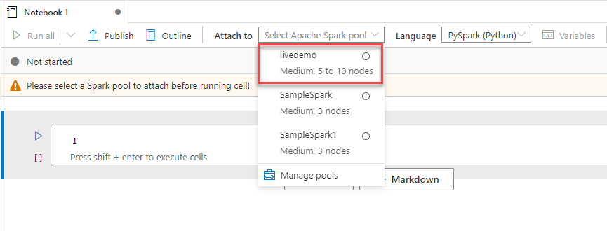

# Episode 3: Big Data and Operational Analytics

## Table of Contents

## Task 1: Create a new Apache Spark Pool

1. Launch the [Azure portal](portal.azure.com) and select your Synapse Workspace resource. Select the **Apache Spark pools** tab on the left-hand side of the page, and select **+ New** at the top of the page.

2. Provide a name for your new pool, such as **livedemo**. However, take note of the following details:

    - The nodes belong to the *MemoryOptimized* SKU, which Microsoft has determined offers the best value for analytics workloads, due to its 8 GB per vCore configuration
    - You choose a node size tier from *Small*, with 4 vCores, to *XXLarge*, with 64 vCores. This provides vertical scaling capability
    - Determine whether to enable *Autoscale* or not. Enabling *Autoscale* will cause Azure to initially provision 5 nodes (in this example), but potentially expand to 10 nodes depending on the load

    

3. Navigate to the **Additional settings** tab. Again, take note of the following:

    - Enable **Automatic pausing** (1) to minimize costs during cluster idle periods (dictated by the **Number of minutes idle**)
    - Upload a custom **Spark configuration** file (2) to improve cluster versatility and performance
    - **Allow session level packages** (3) to support notebooks that require different packages than those loaded by the pool at startup

    

4. Navigate to the **Review + create** tab. Then, select **Create**.

5. **Important:** By itself, a Spark Pool is not a cluster; it is a collection of metadata that specifies the configuration of a Spark cluster provisioned or supplied by Azure when users need it.
    - Different users of the same Synapse Workspace will be allocated isolated Spark clusters for their workloads
    - Consider creating separate Spark pools for Development and Production environments or for different users

## Task 2: Working with Apache Spark

1. Navigate to your Synapse Workspace and select the **Develop** hub. Create a new **Notebook**.

    

2. Select the **livedemo** Spark pool. You may have other pools from earlier tutorials.

    

3. Since Apache Spark is a distributed environment, the principal data structure is a `DataFrame`. A `DataFrame` is a tabular data structure with metadata. Add the code below to the first cell of your new notebook. It defines table data and metadata; parallelizes the data across the cluster nodes; and creates a `DataFrame`.

    ```python
    # Data and column metadata
    columns = ["database", "users_count"]
    data = [("Spark", "20000"), ("SQL", "10000"), ("CosmosDB", "3000")]

    # Parallel distribution
    rdd = sc.parallelize(data)

    # Generate a DataFrame
    sdf1 = rdd.toDF(columns)
    sdf1.printSchema()
    ```

4. Do not run the notebook cell or any subsequent notebook cells in this Task. The screenshots highlight the results of a past execution of the cells. You will run all cells at the end.

5. Paste the code below into a new cell to understand the number of partitions that support the `sdf1` DataFrame. You will see `16` once the cell runs. Use the second code example in a new cell to see the row counts per partition.

    ```python
    print(sdf1.rdd.getNumPartitions())
    ```

    ```python
    print('Data distribution: ', str(sdf1.rdd.glom().map(len).collect()))
    ```

    

6. The 16 partitions result from the number of compute cores allocated to the session (notebook). There are two executors, each of which contain 8 vCores.

    

7. Add the following two code cells. The first sample redistributes the `DataFrame` from 16 partitions to 3 partitions. The second sample visualizes the partition redistribution.

    ```python
    sdf2 = sdf1.repartition(3)
    ```

    ```python
    print('Data distribution: ', str(sdf2.rdd.glom().map(len).collect()))
    ```

    

8. As a performance enhancement, maximize the in-memory storage of the DataFrame.

    ```python
    sdf1.cache()
    ```

    >**Note:** Spark uses lazy execution, which is why caching intermediate results has benefits.

9. Persist the second DataFrame's partitions (`sdf2`) to disk using the following code snippet in a new cell.

    ```python
    from pyspark import StorageLevel

    sdf2.persist(StorageLevel.DISK_ONLY)
    ```

10. Lastly, use the code snippet below (with the `count()` method) to force Spark's lazy execution mechanism.

    ```python
    print(sdf1.count())
    print(sdf2.count())
    ```

If you are feeling confused, reference the [01 Notebook Reference.](./Notebooks/01%20-%20Partition%20-%20Reference.ipynb)

## Task 3: Monitoring Apache Spark (TODO)

1. For the notebook you populated, select **Run all** in the upper left-hand corner of the notebook. 

2. Once all cells finish executing, stop the Spark session by selecting the **Stop session** button at the upper right-hand corner of the page.

3. Navigate to the **Monitor** hub.

    

4. Select **Apache Spark applications** and select the stopped session.

- Application recommendations (Time Skew, Executor Utilization, etc.)
- Manage hub
- Spark UI (memory caching vs. disk caching)

## Task 4: Column Partitions (TODO)