# Episode 4: Serverless Data Lake Exploration and Streaming Analytics

## Table of Contents

- [Episode 4: Serverless Data Lake Exploration and Streaming Analytics](#episode-4-serverless-data-lake-exploration-and-streaming-analytics)
  - [Table of Contents](#table-of-contents)
  - [Introduction](#introduction)
  - [Task 1: Provision Cosmos DB (SQL API)](#task-1-provision-cosmos-db-sql-api)
  - [Task 2: Prepare the Sample in Azure Synapse Analytics](#task-2-prepare-the-sample-in-azure-synapse-analytics)
  - [Task 3: Query Cosmos DB using the Serverless SQL Pool](#task-3-query-cosmos-db-using-the-serverless-sql-pool)
  - [Task 4: Cost Control with serverless SQL pools](#task-4-cost-control-with-serverless-sql-pools)
  - [Task 5: Working with Azure Open Datasets and Serverless SQL Pools](#task-5-working-with-azure-open-datasets-and-serverless-sql-pools)
  - [Task 6: Querying CSV Files with serverless SQL pools](#task-6-querying-csv-files-with-serverless-sql-pools)
  - [Task 7: Querying JSON Files with Serverless SQL Pools](#task-7-querying-json-files-with-serverless-sql-pools)
  - [Task 8: Working with Streaming Data](#task-8-working-with-streaming-data)
  - [Conclusion](#conclusion)

## Introduction

The serverless SQL Pool provides data engineers with on-demand, scalable infrastructure to query their data without the overhead of cluster management. The serverless SQL Pool in Azure Synapse Analytics enables you to query, combine, and analyze data from many data sources. It can query files located in storage, including popular CSV, JSON, and Parquet formats. In addition, via Synapse Link, the serverless SQL pool can also obtain near real-time data from an analytical store in Cosmos DB. This capability lets you establish a SQL-based BI platform foundation while still connecting to near real-time operational data. While we're on the topic of near-real-time data, in this article, you will also learn to ingest and work with streaming data in Synapse Analytics.

## Task 1: Provision Cosmos DB (SQL API)

To integrate Cosmos DB with your Synapse Workspace through Synapse Link, you need a source Cosmos DB account with a database. Follow this Task for more information.

1. In the Azure portal, select **+ Create a resource**. Select **Azure Cosmos DB**. On the **Select API option** page, select **Core (SQL) - Recommended**.

2. On the **Basics** tab, provide the following information. Then, select **Review + create**.

    - **Subscription**: Choose the same subscription that you used to provision Azure Synapse Analytics
    - **Resource group**: Choose the same resource group that your Synapse Workspace is located in
    - **Account name**: Provide a unique, descriptive name
    - **Location**: Choose the same location that you provisioned your Synapse Workspace in
    - **Capacity mode**: Choose **Provisioned throughput**
    - **Apply Free Tier Discount**: Apply the discount if it is available for your subscription

    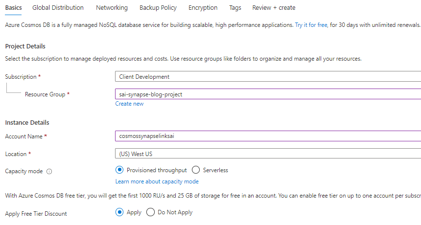

3. Once validation passes, select **Create**.

4. Once the resource finishes provisioning, navigate to your Cosmos DB account and select **Data Explorer** (1). Then, select **Enable Azure Synapse Link** (2).

    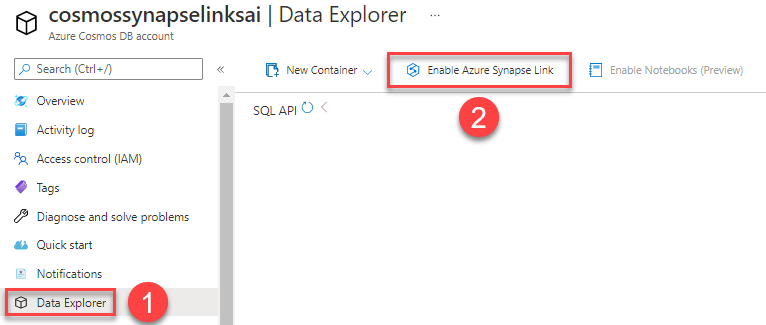

5. Select **Enable Synapse Link**. Wait until this procedure completes.

## Task 2: Prepare the Sample in Azure Synapse Analytics

1. Upload the [sample notebook](CosmosDB-Setup/1CosmoDBSynapseSparkBatchIngestion.ipynb) to your Workspace. This notebook, from Microsoft's samples, uses PySpark to populate three Cosmos DB collections. Use the `livedemo` Apache Spark pool to execute the cells.

    >**Note**: The three CSV files referenced in the notebook are located in the [Data directory.](CosmosDB-Setup/Data/). You can upload these files to ADLS Gen2 directly from the Synapse Data hub, as shown in the notebook.

    >**Note**: Skip step 2 shown in the notebook. You are already an administrator of the Synapse environment.

## Task 3: Query Cosmos DB using the Serverless SQL Pool

 We will now explore using T-SQL queries in the serverless SQL pool to query Cosmos DB using Azure Synapse Link. Azure Synapse Link for Azure Cosmos DB provides a seamless cloud-native hybrid transactional and analytical processing (HTAP) integration between the two products. Analytical queries are typically resource-intensive and complex resulting in negative performance impacts to online transactional processing stores (OLTP). The Synapse Link integration uses the Cosmos DB *analytical store*, which operates independently of the transactional store to alleviate performance issues. This means that you can write complex analytical queries in Azure Synapse Analytics across Cosmos DB data without impacting the performance of transactional workloads.

1. On the **Data** hub, select the **Linked** tab (1). Next, expand **Azure Cosmos DB** and the **RetailSalesDemoDB** (2) linked service. Notice how the three containers you created in the previous task are indicated with an annotation showing that the analytical store is enabled.

    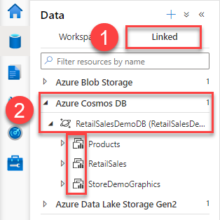

2. Navigate to the **Develop** hub. Select **+** and **SQL script**.

    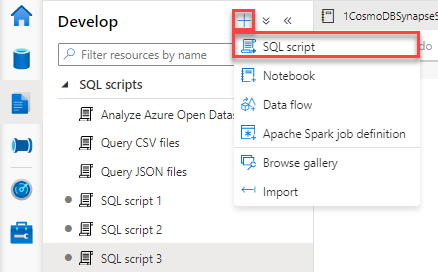

3. Paste the following SQL code into the script. Make sure to replace the `Account` and `Key` placeholders. This query returns 100 rows from the data store. Use the **Run** button in the upper left-hand corner of the SQL editor to run the command.

    ```sql
    SELECT TOP 100 *
    FROM OPENROWSET('CosmosDB', 'Account=[YOUR ACCOUNT];Database=RetailSalesDemoDB;Key=[YOUR KEY]', RetailSales) 
    AS Sales
    ```

    To find `[YOUR KEY]`, navigate to your Cosmos DB account in the Azure portal. Below **Settings**, select **Keys** (1). Then, select **Read-only Keys** (2). Use the **Primary Read-Only Key** as `[YOUR KEY]`.

    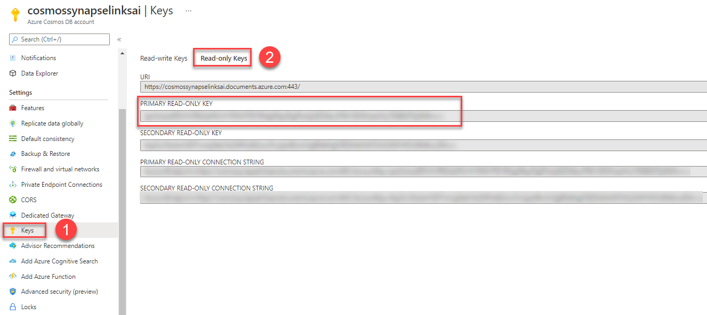

4. Note that standard T-SQL aggregates work as well. For example, use the following SQL statement to count rows in the **RetailSales** Cosmos DB container.

    ```sql
    SELECT COUNT(*)
    FROM OPENROWSET('CosmosDB', 'Account=[YOUR ACCOUNT];Database=RetailSalesDemoDB;Key=[YOUR KEY]', RetailSales) 
    AS Sales
    ```

5. Here is a more complicated example of using a serverless SQL pool to query a Cosmos DB collection. The first subquery returns the product types, the number of transactions by product, and the sum of sales quantity by product. The outer query uses the subquery to determine the percentage of total sales transactions and total sales quantity by category.  

    ```sql
    SELECT 
        productCode,
        SalesTransaction,
        CAST((SalesTransaction / SUM(CAST(SalesTransaction AS DECIMAL(15, 2))) OVER (ORDER BY (SELECT NULL))) * 100 AS DECIMAL(15, 2)) AS SalesTransactionPct,
        SalesQuantity,
        CAST((SalesQuantity / SUM(CAST(SalesQuantity AS DECIMAL(15, 2))) OVER (ORDER BY (SELECT NULL))) * 100 AS DECIMAL(15, 2)) AS SalesQuantityPct
    FROM (
        SELECT
            productCode,
            COUNT(*) AS SalesTransaction,
            SUM(CAST(Quantity as INT)) AS SalesQuantity
        FROM OPENROWSET('CosmosDB', 'Account=cosmossynapselinksai;Database=RetailSalesDemoDB;Key=IpsiOoIzoEfEFcPvP9K3zbPErVHYRWVFFB1RMgfJBeyfGgPfxxhjGEZWeLdT6KV3EWXoeUtVy7E08EGFSjWbRw==', RetailSales) 
        AS Sales
        GROUP BY productCode) AS SubQ
    ```

## Task 4: Cost Control with serverless SQL pools

Due to the on-demand nature of serverless SQL pools, its cost is based on the amount of data processed. While this model is highly flexible, customers may find it difficult to predict costs accurately. Luckily, Azure Synapse Analytics has cost management features, so there aren't any unpleasant surprises come billing time.

1. Navigate to the **Manage** hub. Select **SQL pools** below **Analytics pools**.

2. Next to the **Built-in** serverless SQL pool, select the cost management button.

    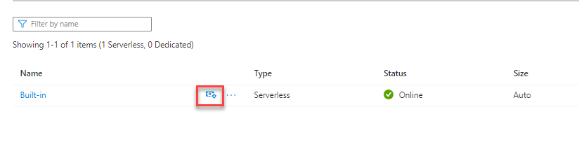

3. In the **Cost Control** window, observe how users can set daily, weekly, and monthly limits. Moreover, users can monitor their current usage to adjust their limits or usage patterns. Read more about this cost control mechanism, including T-SQL support, in the [Azure documentation.](https://docs.microsoft.com/azure/synapse-analytics/sql/data-processed)

    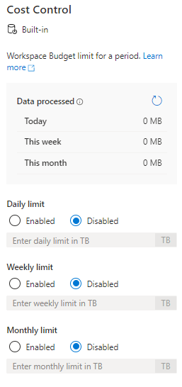

## Task 5: Working with Azure Open Datasets and Serverless SQL Pools

The **Knowledge center** in Azure Synapse Analytics provides an easy-to-use interface to load data from Azure Open Datasets. This data can be used to practice new skills or to augment existing data in your environment. This task will leverage a SQL script from the Knowledge center to query an Azure Open Dataset with the Built-in Serverless SQL pool.

1. Navigate to the **Knowledge center** in your Synapse Workspace. Select **Browse gallery**.

2. Select the **SQL scripts** tab and the **Analyze Azure Open Datasets using serverless SQL pool** sample. Then, select **Continue**.

    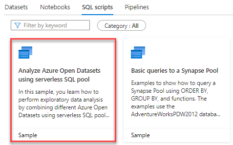

3. Note the T-SQL code sample available on the right-hand side of the screen. Then, select **Open script**.

4. Once the script loads, note that you cannot run any queries until you attach a pool to it. Select the **Connect to** dropdown and choose the **Built-in** Serverless pool from the result.

5. Highlight the first query (lines 25-29) (1). Take note of the wildcards in the Blob Storage URI (i.e. `nyctlc/yellow/puYear=*/puMonth=*/*.parquet`). This indicates to select all Parquet files for all months for all years in the dataset. Execute the selection (2) and observe the result set (3).

    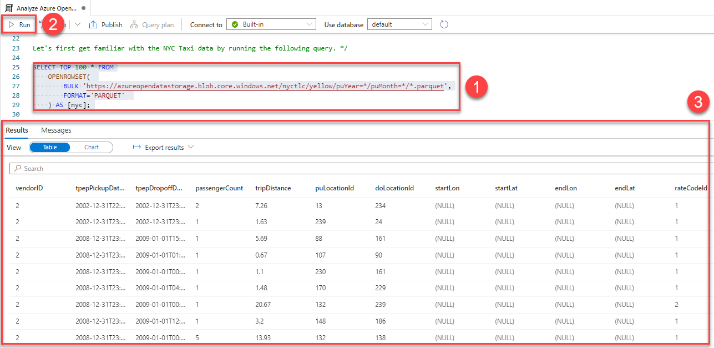

6. Scroll to the query from lines 60 to 70. This query also makes use of wildcards to consolidate multiple Parquet files. However, note the use of the `filepath()` keyword. This keyword supports *partitioning* by limiting data within a particular range. In data warehouses, fact tables are usually partitioned. In this example, the query considers all years from 2009 to 2019 inclusive. The first wildcard delineates the year in the dataset hierarchy.

     hierarchy partitioning keyword")

7. The Synapse Workspace also makes it very easy to visualize result sets. In the output, select **Chart** (1). Then, change the **Chart type** to **Column** (2) to produce a visualization that summarizes the data well.

    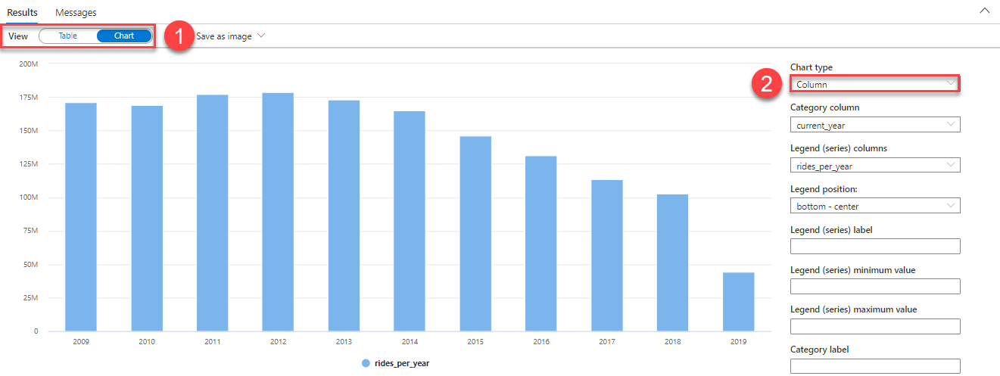

8. To learn more about the `filepath()` keyword, test the query below. It adds `nyc.filepath()` and `nyc.filepath(1)` to the SELECT and GROUP BY clauses. It also limits the year range. Correlate the Parquet file locations with the wildcards in the `OPENROWSET()` call (e.g. `nyc.filepath(1)` correlates to the year, `nyc.filepath(2)` correlates to the month, etc.)

    ```sql
    SELECT
        nyc.filepath(),
        nyc.filepath(1),
        YEAR(tpepPickupDateTime) AS current_year,
        COUNT(*) AS rides_per_year
    FROM
        OPENROWSET(
            BULK 'https://azureopendatastorage.blob.core.windows.net/nyctlc/yellow/puYear=*/puMonth=*/*.parquet',
            FORMAT='PARQUET'
        ) AS [nyc]
    WHERE nyc.filepath(1) >= '2009' AND nyc.filepath(1) <= '2010'
    GROUP BY nyc.filepath(), nyc.filepath(1), YEAR(tpepPickupDateTime)
    ORDER BY 1 ASC;
    ```

Feel free to explore the remainder of the Knowledge Center samples with your new knowledge of serverless SQL pools. Observe that all queries utilize the flexibility of the `OPENROWSET()` function.

## Task 6: Querying CSV Files with serverless SQL pools

In the previous Task, you queried Parquet files with the serverless SQL pool. However, as CSV is a standard file format used to move data to analytical systems, now, you will learn to query CSV files with serverless SQL pools.

1. Returning to the **SQL scripts** Knowledge center samples, search for `Query CSV Files`. Then, select the instance that appears.

    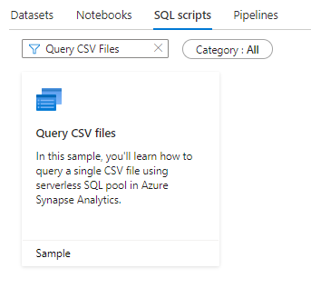

2. Select **Continue**. Once the sample preview loads, select **Open script**.

3. After connecting to the **Built-in** pool, highlight and execute the first query (lines 4-9). Note how the `OPENROWSET()` function references the CSV format and the most performing CSV parser version (`2.0`). Critically, note that the second row in the file is used as the first row of data; the first row in the file represents the header.

    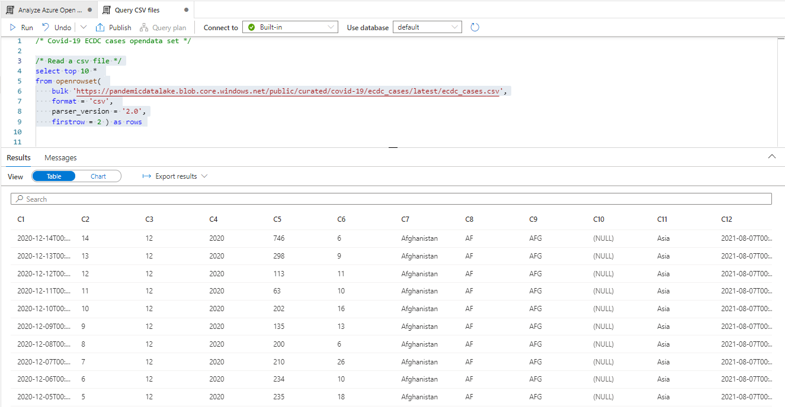

    Note that if we substituted `firstrow = 1` into the query, the header would be displayed in the result set.

    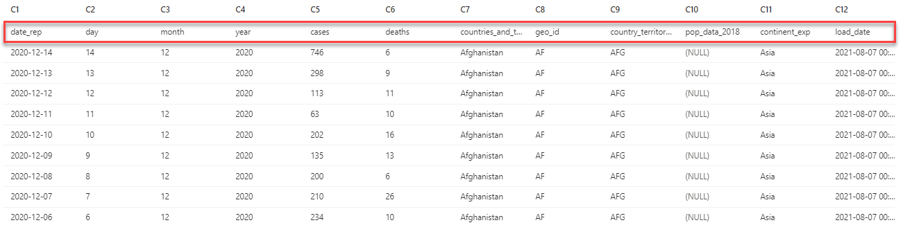

4. To retrieve specific columns from a CSV file, use the `WITH` clause, as shown in the second query in the sample (lines 14-24). In addition to specifying the name and data type of the CSV column, you must also set the column's position in the file. For example, the `date_rep` column is the first column in the CSV file, and the `geo_id` column is the eighth column. Using column references simplifies naming and casting columns in the CSV file.

    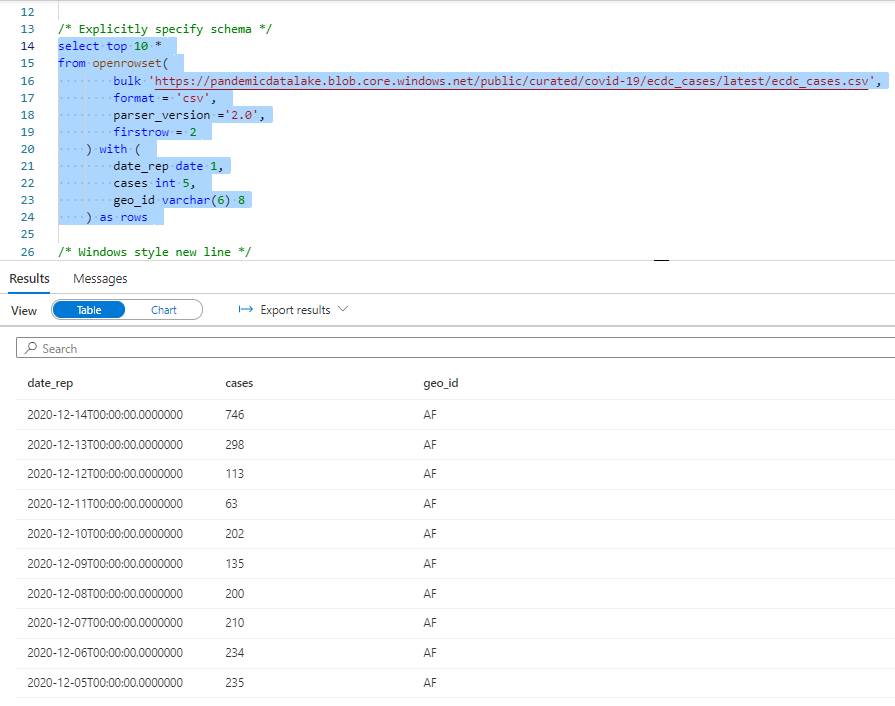

Feel free to explore the remaining queries in the sample. For example, the query from lines 66-81 explores collation.

## Task 7: Querying JSON Files with Serverless SQL Pools

JSON files are another popular format that data engineers encounter. Like Parquet and CSV files, Synapse serverless SQL pools support various techniques to query and manipulate them.

1. In the Knowledge center samples, search for the **Query JSON Files** SQL script. Select **Continue**.

    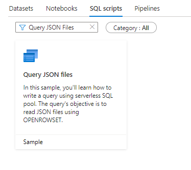

2. Once the preview loads, select **Open script**.

3. Connect the SQL script to the **Built-in** SQL pool. Then, navigate to the query from lines 45-61. This query uses the `JSON_VALUE()` function to extract JSON object fields from the traversed files. We added a `TOP 10` clause to the query and excluded the `WHERE` clause to improve query result times.

    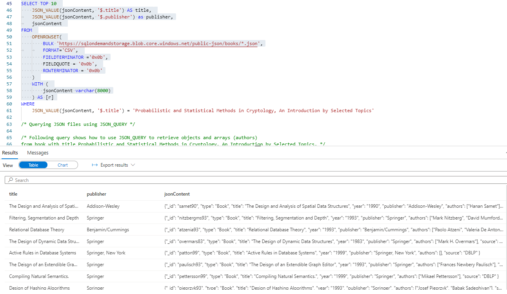

4. Scroll to the following query (located on lines 68-83). This example uses the `JSON_QUERY()` function, as the `authors` field of the JSON object is a collection. Again, we have added a `TOP 10` clause and excluded the `WHERE` clause from the selection.

    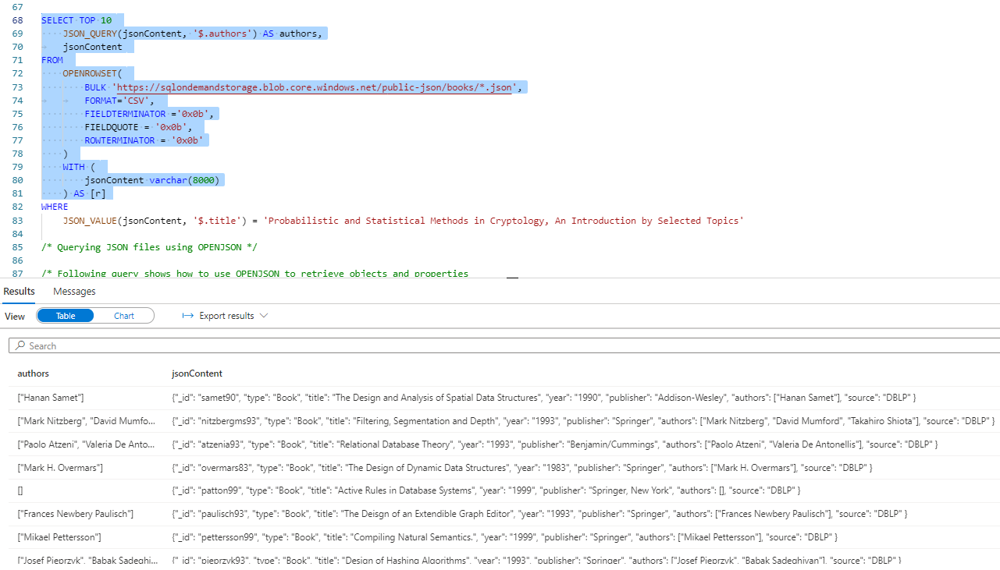

## Task 8: Working with Streaming Data

So far, we have explored interacting with operational data from Cosmos DB and various file formats. We will conclude with a brief overview of working with streaming data.

1. Navigate to the **Manage** hub and select **SQL pools**. Select **+ New**.

2. In the **Create dedicated SQL pool** window, provide a name for the new pool, such as **Streaming_Pool**. Then, lower the **Performance level** to **DW100c** to minimize expenses. Finally, select **Review + create** once you finish this to provision the pool.

    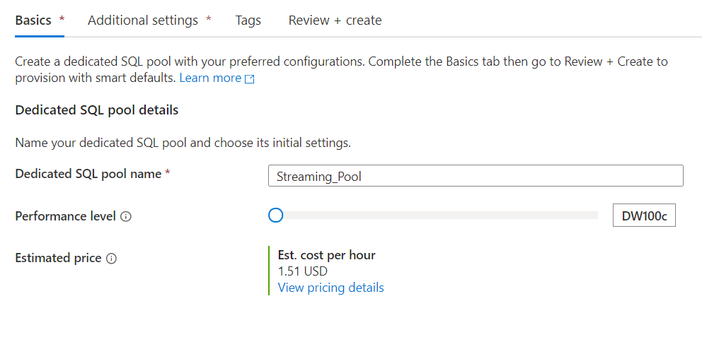

    >**Note**: You must pause the dedicated SQL pool once you finish your experimentation; otherwise, you will be billed.

    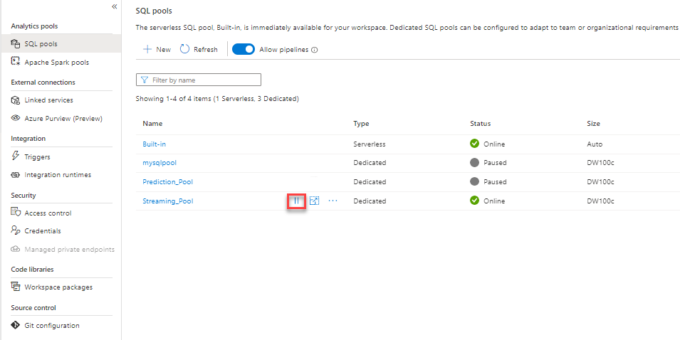

3. Create a new SQL script with the contents from the [Setup SQL Script.](Streaming-Setup/Telco%20Data%20Setup.sql). Again, pay close attention to the comments -- you will need to manually use the dropdown in the SQL editor to set the correct database for the command blocks you execute.

4. Follow the instructions in [this](https://docs.microsoft.com/azure/stream-analytics/stream-analytics-real-time-fraud-detection) document from the Microsoft documentation. Stop once you arrive at the **Configure job output** section, as you will not be directing data to Power BI.

5. In your Stream Analytics job, select **Storage account settings** below **Configure**. Then, select **Add storage account**.

6. In the form that appears, select the Azure Data Lake Storage Gen2 account that you are using from your subscription. Keep all other settings at their defaults. Once you are done, select **Save**.

    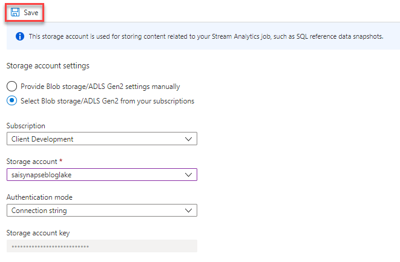

7. Below **Job topology**, select **Outputs**. Below **Add**, select **Azure Synapse Analytics**.

8. For the new output, provide the following details. Then, select **Save**.

    - **Output alias**: Use `asa-telco-output`, as this is what we will reference in the job definition query
    - Enable **Select SQL Database from your subscriptions**
    - **Database**: Select the name of the dedicated pool you created earlier
    - Use **Connection string** as the **Authentication mode**
      - Use `StreamAnalyticsUser` as the **Username**
      - Use `Password.1!!` as the **Password**
    - Use `telcodata` as the name of the **Table**

9. Navigate to the **Query** tab. Input the following query. Then, select **Save query**. Note that we are selecting particular columns from the input for brevity.

    ```sql
    SELECT
        RecordType,
        FileNum,
        SwitchNum,
        CallingNum,
        CallingIMSI,
        CalledNum,
        CalledIMSI,
        DateS
    INTO
        [asa-telco-output]
    FROM
        CallStream
    ```

    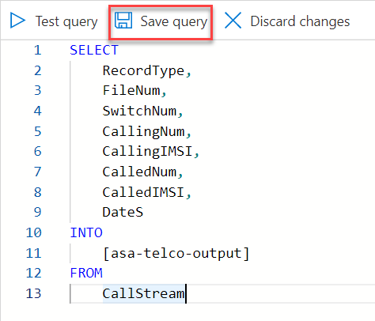

10. Return to the **Overview** page (1). Select **Start** (2).

    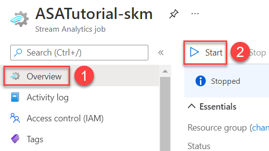

11. When prompted, select **Start** again.

    >**Note**: You should already have the streaming data generator running. If you do not see streaming data, run the command below in the same directory as the generator executable file.

    ```cmd
    .\telcodatagen.exe 1000 0.2 2
    ```

12. Return to Synapse Studio. Create a new SQL script, again connecting to the correct dedicated pool and database. Run the query below multiple times to see the change in the quantity of data populated in the dedicated pool table.

    ```sql
    SELECT COUNT(*)
    FROM dbo.telcodata;
    ```

    Data is being populated in the Data Warehouse in real-time. Microsoft states that the throughput of a Synapse Stream Analytics output can reach [up to 200 MB/s](https://docs.microsoft.com/azure/stream-analytics/azure-synapse-analytics-output).

In this Task, we demonstrated an actual example of a streaming data workload. The true power of Stream Analytics comes from grouping and analyzing data over windows of time. Read about window functions [here.](https://docs.microsoft.com/azure/stream-analytics/stream-analytics-window-functions)

## Conclusion

In this blog post, you have seen how to query data from Cosmos DB in a Serverless SQL pool via the analytical store, a feature that eliminates the performance penalty of running complex queries on a high-volume transactional system. Moreover, you learned the T-SQL utilities available to query Parquet, CSV, and JSON files. Lastly, you configured a SQL dedicated pool, Streaming Analytics, and an Event Hub to simulate a streaming data example. Note that the streaming example applies to other domains, such as IoT.
