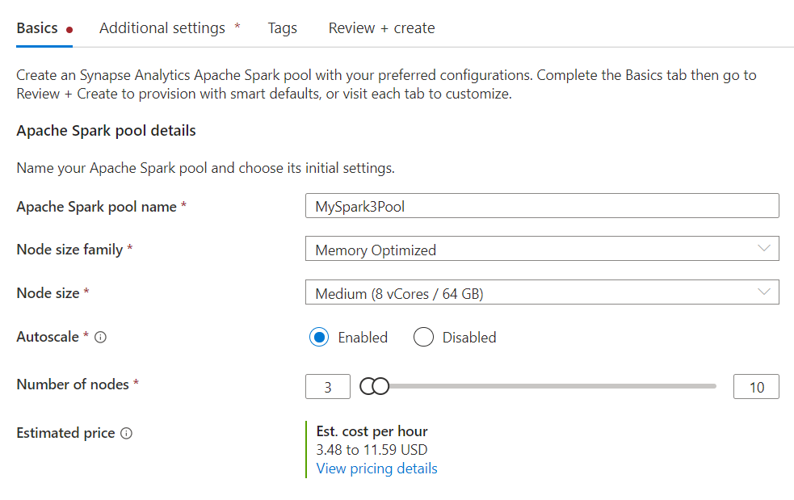
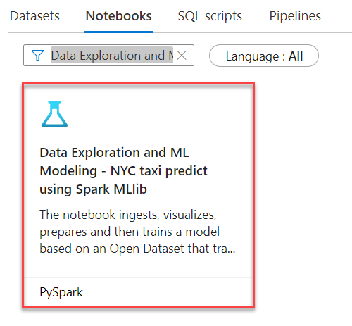
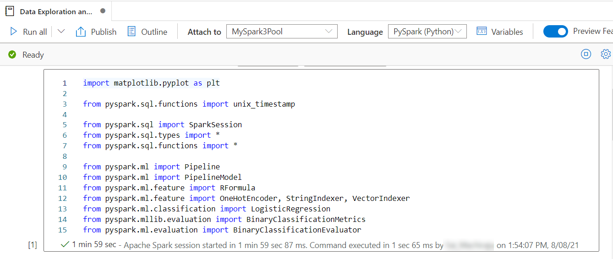
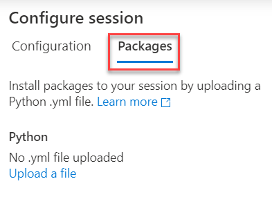
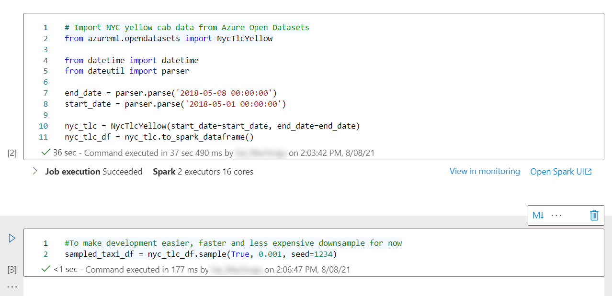
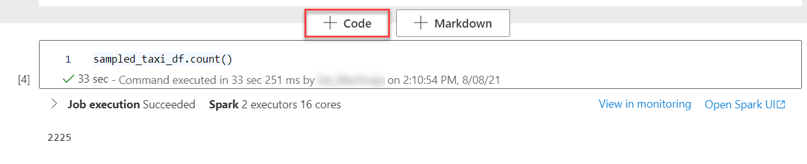
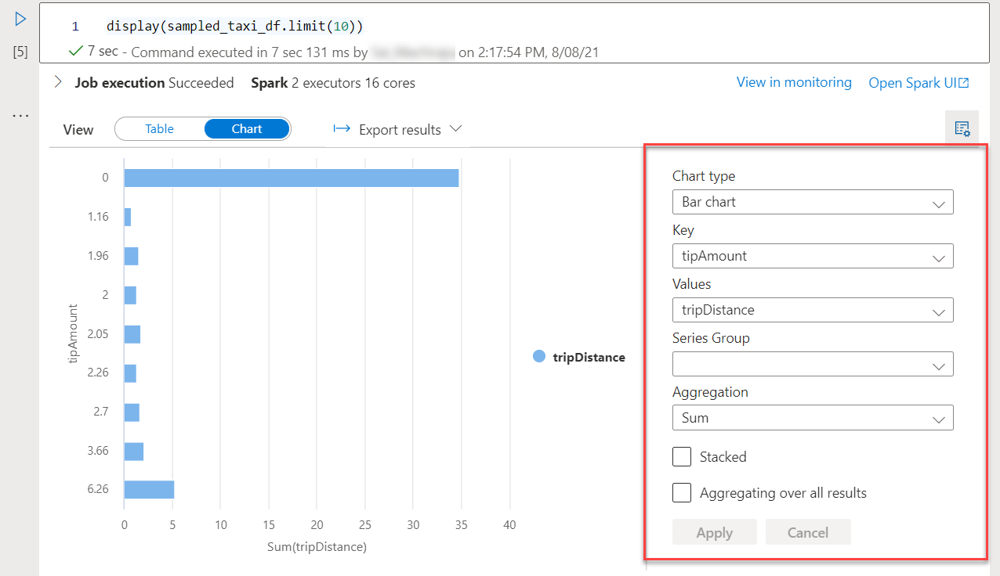
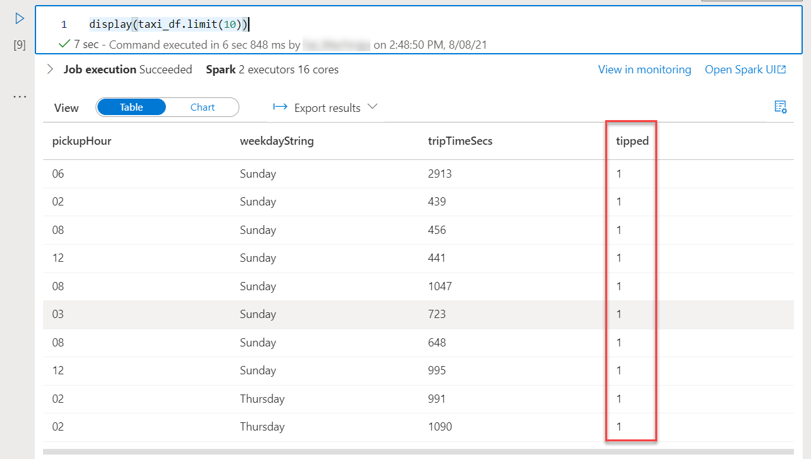
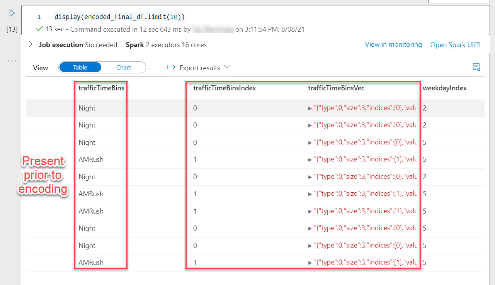
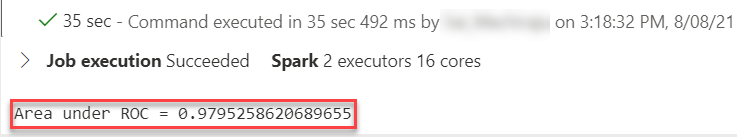

# Episode 5: Data Science and Predictive Analytics

## Table of Contents

## Introduction

## Task 1: Create a Serverless Apache Spark Pool

We discussed how to create an Apache Spark pool in the third post of this series. This Task is an excellent review of the basic concepts you learned about Apache Spark pools in that post.

1. Navigate to the **Manage** hub and select **Apache Spark pools**. Select **+ New**.

    >**Note**: The third post in this series did not use the Manage hub to provision the `livedemo` Apache Spark pool, but the configuration will be identical

2. On the **Basics** tab, populate the form with the following information. Then, select **Next: Additional settings >**.

    - **Apache Spark pool name**: Use a name of your choice, such as **MySpark3Pool**
    - **Node Size**: Choose **Medium (8 vCores / 64 GB)**
    - **Autoscale**: Select **Enabled**

    

3. On the **Additional settings** tab, take note of the following. Then, select **Review + create**.
   
    - Adjust the **Number of minutes idle** parameter to 30 minutes to increase the allowed idle duration
    - Adjust the **Apache Spark** version to **3.0 (preview)** to take advantage of the capabilities of this newer version of Apache Spark, such as adaptive query execution and improved Delta Lake support
    - Enable **Allow session level packages**

4. Once validation passes, select **Create**. Wait for the resource to provision before continuing to the next Task.

## Task 2: Use a Knowledge Center Machine Learning Notebook Example

In this Task, you utilize a Knowledge center notebook that uses Azure Open Datasets to train a machine learning model to predict whether or not a passenger will give a taxi driver a tip (logistic regression problem). You will be briefly introduced to core machine learning concepts through this sample.

1. Navigate to the **Knowledge center** and select **Browse gallery**.

2. Select the **Notebooks** tab and enter the search query `Data Exploration and ML Modeling`. Select the notebook that appears, titled **Data Exploration and ML Modeling - NYC taxi predict using Spark MLlib**. Then, select **Continue**.

    

3. Select **Open notebook** on the preview page.

4. Ensure that the notebook is attached to the **MySpark3Pool** Apache Spark pool and execute the first cell. The first cell justs imports libraries. Note that most of these libraries are bundled with the runtime.

    

    To understand how to add more libraries to the Spark session, open the **Properties** pane. Select the **Configure session** link.

    Select the **Packages** tab below the **Configure session** pane. Notice that you can upload a YAML file with your desired packages. You have this option because you allowed session-level packages when you created the Apache Spark pool resource.

    

5. Scroll to the next cell. The dataset used in this example (NYC yellow cab data) originates from Azure Open Datasets, meaning that the dataset does not have to manually be uploaded to the Data Lake. It considers one week of data. The second cell further reduces the number of records that the subsequent cells manipulate. Run both cells.

    

    To confirm how many records are present in the downsampled dataset, add a new cell by selecting the **+ Code** button below the prior cell. Then, leverage the `count()` DataFrame method. There are 2,225 records.

    

6. Add another cell. This time, use the `display()` function to view a neat representation of the DataFrame, limited to 10 rows.

    ```python
    display(sampled_taxi_df.limit(10))
    ```

    As shown in the previous blog post, notebooks in Azure Synapse provide utilities for visualizing result sets as charts.

    

7. The next cell discusses more formal Exploratory Data Analysis. It consists of three plots. Run the cell to visualize them.
   
   - A histogram to visualize the distribution of tips
   - A box plot to visualize dataset outliers (outliers often mislead machine learning models)
   - A scatter plot to visualize correlations between columns in the dataset (for example, the faint correlation between fare amount and tip amount)

8. The next cell selects the relevant columns from the DataFrame, renames existing columns (using the `alias()` method), and generates new features (such as `tripTimeSecs`, the duration of the trip). Moreover, it eliminates outliers by constraining the column values of the DataFrame. Run the cell.

    >**Note**: *Featurization* involves generating new features from existing data. It is done iteratively to achieve the greatest model performance.

    Again, feel free to add a cell and use the `display()` function to visualize the `taxi_df` DataFrame. For example, the `tipped` column uses the value of the tip in the original DataFrame to determine whether or not the driver was tipped (a `1` represents that the driver was given a tip, while a `0` represents that the driver was not given a tip).

    

9. The next cell performs additional featurization. It classifies different time periods for when the trip starts, such as `Night` and `AMRush`. It also excludes very short (less than 30 seconds) or very long trips (longer than 2 hours) from the dataset. Run the cell.

10. As mentioned previously, this is a logistic regression problem; the model determines whether or not a passenger will tip depending on certain features. The machine learning model used in this notebook requires numerical inputs. This means that categorical data -- such as the time periods mentioned in the previous step -- must be converted to a vector representation through *one-hot encoding*. Run the cell.

    To further understand this critical machine learning concept, add a new cell to display `encoded_final_df`, which contains the encoded columns.

    

11. We are close to training the machine learning model. However, we need separate datasets to train and test the model. In this case, 70% of the data samples are used for training, and the remaining 30% of the data samples are used for testing. Run the cell.

12. The next cell trains the model according to the logistic regression algorithm, as emphasized previously. Note that the last value returned by the model indicates the performance of the model, as quantified by a metric known as the `Area under ROC`. You should see a result very close to `1`. This suggests a very performant model. Run the cell.

    

13. Consult the last cell to visualize the ROC curve mentioned in the last step. Consult [this](https://developers.google.com/machine-learning/crash-course/classification/roc-and-auc) article for more information regarding the ROC curve.

You have trained a machine learning model using Azure Open Datasets and built-in SDKs in the Apache Spark pools. Consider the following next steps:

- Converting the model to the ONNX format
- Registering the model in a model registry for easy deployment (refer to the upcoming tasks)

## Task 3: Provision an Azure Machine Learning Workspace