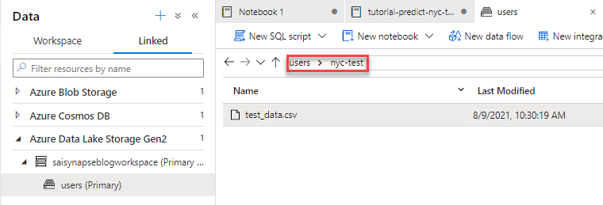

# Episode 5: Data Science and Predictive Analytics

## Table of Contents

- [Episode 5: Data Science and Predictive Analytics](#episode-5-data-science-and-predictive-analytics)
  - [Table of Contents](#table-of-contents)
  - [Introduction](#introduction)
  - [Task 1: Create a Serverless Apache Spark Pool](#task-1-create-a-serverless-apache-spark-pool)
  - [Task 2: Use a Knowledge Center Machine Learning Notebook Example](#task-2-use-a-knowledge-center-machine-learning-notebook-example)
  - [Task 3: Create Training Data Apache Spark Table](#task-3-create-training-data-apache-spark-table)
  - [Task 4: Provision an Azure Machine Learning Workspace](#task-4-provision-an-azure-machine-learning-workspace)
  - [Task 5: Using Azure Machine Learning AutoML in the Synapse Workspace](#task-5-using-azure-machine-learning-automl-in-the-synapse-workspace)
  - [Task 6: Utilize the Trained Model against the Dedicated Pool](#task-6-utilize-the-trained-model-against-the-dedicated-pool)
  - [Conclusion](#conclusion)

## Introduction

The benefit of accumulating large amounts of data is identifying trends and patterns used for predictive analysis and business understanding. Azure Synapse Analytics provides several machine learning capabilities, including the PREDICT SQL statement to consume models and Apache Spark (Spark MLLib) and Azure  ML integrations used for model training, deployment, and consumption.

In this post, you will train two machine learning models to understand the data science capabilities of Azure Synapse Analytics. The first model uses a Knowledge center notebook and the `pyspark.ml` SDK to build a data preprocessing and training pipeline. The second model uses the Synapse AutoML integration and an Apache Spark table to train a regression model. This process requires no coding and generates a high-performing model. Lastly, we apply the trained regression model against a table in a dedicated SQL pool. You will learn the T-SQL needed to populate a distributed table from a CSV file.

As we near the completion of this series, we will touch on concepts from earlier posts. This post will utilize your knowledge of navigating the Synapse Workspace and provisioning Apache Spark and dedicated SQL pools.

## Task 1: Create a Serverless Apache Spark Pool

We discussed how to create an Apache Spark pool in the third post of this series. This Task is an excellent review of the basic concepts you learned about Apache Spark pools in that post.

1. Navigate to the **Manage** hub and select **Apache Spark pools**. Select **+ New**.

    >**Note**: The third post in this series did not use the Manage hub to provision the `livedemo` Apache Spark pool, but the configuration will be identical

2. On the **Basics** tab, populate the form with the following information. Then, select **Next: Additional settings >**.

    - **Apache Spark pool name**: Use a name of your choice, such as **MySpark3Pool**
    - **Node Size**: Choose **Medium (8 vCores / 64 GB)**
    - **Autoscale**: Select **Enabled**

    

3. On the **Additional settings** tab, take note of the following. Then, select **Review + create**.

    - Adjust the **Number of minutes idle** parameter to 30 minutes to increase the allowed idle duration
    - Adjust the **Apache Spark** version to **3.0 (preview)** to take advantage of the capabilities of this newer version of Apache Spark, such as adaptive query execution and improved Delta Lake support
    - Enable **Allow session level packages**

4. Once validation passes, select **Create**. Wait for the resource to be provisioned before continuing to the next Task.

## Task 2: Use a Knowledge Center Machine Learning Notebook Example

In this Task, you utilize a Knowledge center notebook that uses Azure Open Datasets to train a machine learning model to predict whether or not a passenger will give a taxi driver a tip (logistic regression problem). You will be briefly introduced to core machine learning concepts through this sample.

1. Navigate to the **Knowledge center** and select **Browse gallery**.

2. Select the **Notebooks** tab and enter the search query `Data Exploration and ML Modeling`. Next, select the notebook that appears, titled **Data Exploration and ML Modeling - NYC taxi predict using Spark MLlib**. Then, select **Continue**.

    

3. Select **Open notebook** on the preview page.

4. Ensure that the notebook is attached to the **MySpark3Pool** Apache Spark pool and execute the first cell. The first cell imports libraries. Note that most of these libraries are bundled with the runtime.

    

    To understand how to add more libraries to the Spark session, open the **Properties** pane. Then, select the **Configure session** link.

    Select the **Packages** tab below the **Configure session** pane. Notice that you can upload a YAML file with your desired packages. You have this option because you allowed session-level packages when you created the Apache Spark pool resource.

    

5. Scroll to the next cell. The dataset used in this example (NYC yellow cab data) originates from Azure Open Datasets, meaning that the dataset does not have to be uploaded to the Data Lake manually. It considers one week of data. The second cell further reduces the number of records that the subsequent cells manipulate. Run both cells.

    

    To confirm how many records are present in the downsampled dataset, add a new cell by selecting the **+ Code** button below the previous cell. Then, leverage the `count()` DataFrame method. There are 2,225 records.

    

6. Add another cell. This time, use the `display()` function to view a neat representation of the DataFrame, limited to 10 rows.

    ```python
    display(sampled_taxi_df.limit(10))
    ```

    Notebooks in Azure Synapse provide utilities for visualizing result sets as charts.

    

7. The next cell discusses more formal Exploratory Data Analysis. It consists of three plots. Run the cell to visualize them.

   - A histogram to visualize the distribution of tips
   - A box plot to visualize dataset outliers (outliers often mislead machine learning models)
   - A scatter plot to visualize correlations between columns in the dataset (for example, the faint correlation between fare amount and tip amount)

8. The next cell selects the relevant columns from the DataFrame, renames existing columns (using the `alias()` method), and generates new features (such as `tripTimeSecs`, the duration of the trip). Moreover, it eliminates outliers by constraining the column values of the DataFrame. Run the cell.

    >**Note**: *Featurization* involves generating new features from existing data. It is done iteratively to achieve the greatest model performance.

    Again, feel free to add a cell and use the `display()` function to visualize the `taxi_df` DataFrame. For example, the `tipped` column uses the value of the tip in the original DataFrame to determine whether or not the driver was tipped (a `1` represents that the driver was given a tip, while a `0` denotes that the driver was not given a tip).

    

9. The next cell performs additional featurization. It classifies different time periods for when the trip starts, such as `Night` and `AMRush`. It also excludes very short (less than 30 seconds) or very long trips (longer than 2 hours) from the dataset. Run the cell.

10. As mentioned previously, this is a logistic regression problem; the model determines whether or not a passenger will tip depending on specific features. The machine learning model used in this notebook requires numerical inputs. This means that categorical data -- such as the time periods mentioned in the previous step -- must be converted to a vector representation through *one-hot encoding*. Run the cell.

    To further understand this critical machine learning concept, add a new cell to display `encoded_final_df`, which contains the encoded columns.

    

11. We are close to training the machine learning model. However, we need separate datasets to train and test the model. In this case, 70% of the data samples are used for training, and the remaining 30% are used for testing. Run the cell.

12. The next cell trains the model according to the logistic regression algorithm, as emphasized previously. Note that the last value returned by the model indicates the model's performance, as quantified by a metric known as the `Area under ROC`. You should see a result very close to `1`. This suggests a very performant model. Run the cell.

    

13. Consult the last cell to visualize the ROC curve mentioned in the previous step. Then, consult [this](https://developers.google.com/machine-learning/crash-course/classification/roc-and-auc) article for more information regarding the ROC curve.

You have trained a machine learning model using Azure Open Datasets and built-in SDKs in the Apache Spark pools. Consider the following next steps:

- Converting the model to the ONNX format
- Registering the model in a model registry for easy deployment (refer to the upcoming tasks)
- Using the low-code AutoML experience in the Synapse Workspace (also refer to the following tasks)

## Task 3: Create Training Data Apache Spark Table

To use the AutoML integration with Azure Synapse Analytics, create a Spark table with the preprocessed training data. You will use a provided notebook to complete this Task.

1. Navigate to the **Develop** hub. Upload the [Create Spark Table with NYC Taxi Data](./Notebooks/Create%20Spark%20Table%20with%20NYC%20Taxi%20Data.ipynb) notebook to your Synapse workspace.

2. Connect the notebook to the **MySpark3Pool** and execute all the cells. It essentially functions the same as the dataset creation and featurization steps shown in the previous Task. Observe the **nyc_taxi** table when the notebook completes. This table can be found in the **Data** hub under the **default** database.

    

## Task 4: Provision an Azure Machine Learning Workspace

The AutoML experiment integration in the Synapse Workspace depends on Azure Machine Learning. In this task, you will provision an Azure Machine Learning workspace and link it to the Synapse Workspace through a Managed System Identity.

1. In the Azure portal, select **+ Create a resource**. Then, search for **Machine Learning** and select **Create**.

2. In the **Basics** form, supply the correct **Subscription** and **Resource group**. Moreover, provide a descriptive **Workspace name**.

    >**Note**: The other resources, such as the storage account, are deployed and configured automatically by the Machine Learning workspace.

    

3. Select **Review + create**. Once validation passes, select **Create**.

4. Once the deployment completes, select the **Access control (IAM)** tab of the new workspace resource. Select **+ Add** and **Add role assignment**. You need to assign your Synapse Workspace Managed Identity the Contributor role over the Azure Machine Learning workspace for the Linked Service to function.

5. In the **Add role assignment** form, enter the following parameters. Then, select **Save**.

    - **Role**: Select **Contributor**
    - **Assign access to**: Keep the default (**User, group, or service principal**)
    - **Select**: Search for your Synapse Workspace managed identity (it will have the same name as your Synapse Workspace resource)

    

6. Navigate back to your Synapse Workspace. Select the **Manage** hub and select **Linked services**. Select **+ New**.

7. Search for and select **Azure Machine Learning** from the collection of integrations. Select **Continue**.

    

8. In the **New linked service (Azure Machine Learning)** window, provide the following details. Then, select **Create** once you are complete.

    - **Name**: Provide a descriptive name, like **Sai_AML_ws**
    - **Authentication method**: Select **Managed Identity**, as we assigned the Contributor role to the Workspace Managed Identity over the Azure Machine Learning Workspace resource
    - **Azure Machine Learning workspace selection method**: Select **From Azure subscription**
      - Select your **Azure subscription** and **Azure Machine Learning workspace name** from the dropdown menus

    

9. Select **Publish all** at the top of the window. This will create the Azure Machine Learning Workspace linked service. When asked to confirm the changes to publish, select **Publish**.

    >**Note**: Do not be concerned if this operation publishes a different number of resources in your environment than shown in the image below.

    

## Task 5: Using Azure Machine Learning AutoML in the Synapse Workspace

AutoML helps automate data science workflows. Users are not required to write every single line of code needed to train a machine learning model but play a supervisory role to ensure that model performance is sufficient for the business use case.

AutoML is versatile because it trains multiple models within a given time period to determine the best performer. This means that a single experiment is associated with numerous models, though the machine learning practitioner chooses the optimal algorithm.

1. In the **Data** hub, return to the **default** database and right-click the **nyc_taxi** Spark table. Select **Machine Learning >** and **Train a new model**.

    

2. In the **Train a new model - Configure experiment** window, you must provide a **Target column** and an **Apache Spark pool**. In this example, use **fareAmount** as the **Target column** and **MySpark3Pool** as the **Apache Spark pool**. Then, select **Continue**.

    >**Note**: In this experiment, the machine learning model predicts the fare amount based on the dataset features.

    

3. In the **Train a new model - Choose a model type** window, select **Regression**. This model uses features to determine a continuous output value. Select **Continue**.

4. In the **Train a new model - Configure regression model** window, observe the following:

    - AutoML uses the **Primary metric** to rank machine learning models according to their performance. Keep the **Primary metric** set to **Spearman correlation** for this exercise
    - The **Maximum training job time (hours)** specifies the time constraints for the AutoML experiment. Use **1** for this demo
    - **Max concurrent iterations** specifies how many training iterations run in parallel
    - Select **Enable** below **ONNX model compatibility**. This allows you to use the model against data located in a dedicated SQL pool

    

5. At the bottom of the window, note that you have the option to **Create run** or **Open in notebook**. **Create run** will begin the AutoML experiment, whereas **Open in notebook** allows the practitioner to review the training scripts. Select **Open in notebook**.

6. Once the notebook opens, select **Run all**.

    >**Note**: While the notebook is running, if you want to test the deployed machine learning model against a dedicated SQL pool table, you may wish to provision a dedicated SQL pool or use the existing **Streaming_Pool** dedicated pool from the previous post. The pool I configured is called **Prediction_Pool** and is set to the lowest performance level (**DW100c**).

    

## Task 6: Utilize the Trained Model against the Dedicated Pool

Applying a trained machine learning model to a new dataset is known as *inference*, a key component of data science pipelines. Luckily, the T-SQL `PREDICT()` keyword bridged the gap between ONNX-compatible models and warehoused data.

1. Load the [testing data CSV file](./Data/test_data.csv) to your ADLS Gen2 account in the `nyc-test` directory. This CSV file was generated using the notebook available from [this](https://docs.microsoft.com/azure/synapse-analytics/machine-learning/tutorial-sql-pool-model-scoring-wizard) document in the Microsoft docs.

    

2. Once you finish uploading the CSV file, create a new SQL script with the following contents. Ensure to replace the `[ADLS Account Name]` placeholder appropriately. The script creates a new distributed table in the dedicated pool and uses the SQL `COPY` statement to load the CSV data into the table.

    ```sql
    IF NOT EXISTS (SELECT * FROM sys.objects WHERE NAME = 'nyc_taxi' AND TYPE = 'U')
    CREATE TABLE dbo.nyc_taxi
    (
        tipped int,
        fareAmount float,
        paymentType int,
        passengerCount int,
        tripDistance float,
        tripTimeSecs bigint,
        pickupTimeBin nvarchar(30)
    )
    WITH
    (
        DISTRIBUTION = ROUND_ROBIN,
        CLUSTERED COLUMNSTORE INDEX
    )
    GO

    COPY INTO dbo.nyc_taxi
    (tipped 1, fareAmount 2, paymentType 3, passengerCount 4, tripDistance 5, tripTimeSecs 6, pickupTimeBin 7)
    FROM 'https://[ADLS Account Name].dfs.core.windows.net/users/nyc-test/test_data.csv'
    WITH
    (
        FILE_TYPE = 'CSV',
        ROWTERMINATOR='0x0A',
        FIELDQUOTE = '"',
        FIELDTERMINATOR = ',',
        FIRSTROW = 2
    )
    GO

    SELECT TOP 100 * FROM nyc_taxi
    GO
    ```

3. Execute the SQL script after attaching it to the correct dedicated SQL pool. Observe the returned result set.

    

4. Select the new table in the **Data** hub. Right-click the table and select **Machine Learning >** and **Predict with a model**.

    

5. In the **Predict with a model** window, select your Azure Machine Learning workspace and the best model from the experiment. Then, select **Continue**.

    

6. You will be asked to verify the **Input mapping** and **Output mapping**. Select **Continue**. Here, you can specify the name of the prediction column.

7. Next, you will be asked to specify a name for the machine learning model inference stored procedure and model target table. Once you configure the parameters below, select **Deploy model + open script**.

    - For **Stored procedure name**, provide a name that references the `dbo` schema, such as `dbo.nyc_taxi_sp`
    - For **Select target table**, select **Create new**
      - For **New table**, provide a table name that references the `dbo` schema, such as `dbo.models`

    

8. Run the new SQL script that opens. Note the prediction column in the result set. In this case, the predictions are for the fare amount.

    

Congratulations. You have just executed a machine learning model against a dedicated pool seeded with test data.

## Conclusion

In previous blog posts, you learned about the key components of Azure Synapse Analytics, such as Data Lake integration, Apache Spark pools, integration with transactional data sources. This blog post leverages these technologies to help you visualize, prepare, and innovate with your data through machine learning models and standard data science technologies, like Azure Machine Learning workspaces.

In this example, we applied a trained machine learning model against a dedicated SQL pool. In your business, can you leverage pipelines to consolidate a variety of data sources in a SQL pool and enrich them with intelligence?
