# Episode 6: Optimize Data Warehouse Workloads for BI and Reporting

## Table of Contents

- [Episode 6: Optimize Data Warehouse Workloads for BI and Reporting](#episode-6-optimize-data-warehouse-workloads-for-bi-and-reporting)
  - [Table of Contents](#table-of-contents)
  - [Introduction](#introduction)
  - [Task 1: Creating a Dedicated SQL Pool](#task-1-creating-a-dedicated-sql-pool)
  - [Task 2: Data Plane Access Control](#task-2-data-plane-access-control)
  - [Task 3: Create and Query an External Table](#task-3-create-and-query-an-external-table)
  - [Task 4: Load Data using the COPY Statement](#task-4-load-data-using-the-copy-statement)
  - [Task 5: Result Set Caching](#task-5-result-set-caching)
  - [Task 6: Dynamic Data Masking](#task-6-dynamic-data-masking)
  - [Task 7: Row-Level Security](#task-7-row-level-security)
  - [Task 8: Creating a Power BI Dashboard Linked Service](#task-8-creating-a-power-bi-dashboard-linked-service)
  - [Task 9: Creating a Power BI Dashboard in Power BI Desktop](#task-9-creating-a-power-bi-dashboard-in-power-bi-desktop)
  - [Conclusion](#conclusion)

## Introduction

This blog post dives deep into dedicated SQL pools, the critical component of Azure's cloud-native data warehousing and BI stack. We will begin this post by discussing how to create a dedicated SQL pool and control access. Then, we will create tables and external tables and populate them with data. We will discuss performance and security enhancements for dedicated SQL pools. Lastly, we will conclude with the Power BI integration for Synapse Workspaces.

## Task 1: Creating a Dedicated SQL Pool

While you have been exposed to provisioning dedicated SQL pools previously, in this Task, we will provide additional detail regarding the distributed SQL component of Azure Synapse Analytics.

1. Navigate to the **Manage** hub and select **SQL pools**. Select **+ New**.

2. In the **Basics** tab of the **Create dedicated SQL pool** window, provide a name of your choice and set the performance level to **DW100c**. We will be working with a small amount of data, so this provisioned capacity is sufficient.

    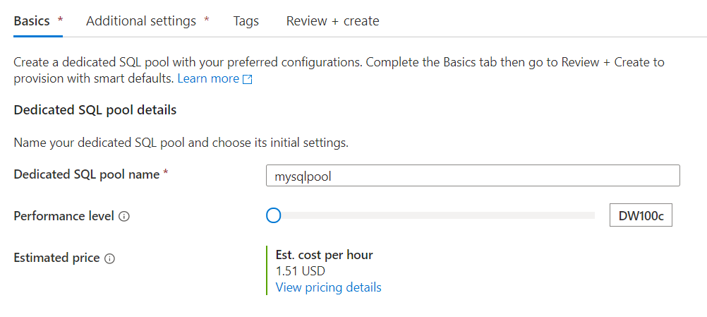

3. Select **Next: Additional settings >**. Observe that you can pre-populate the SQL pool from a **Backup** or a **Restore point**. This is useful to build separate development and production environments.

    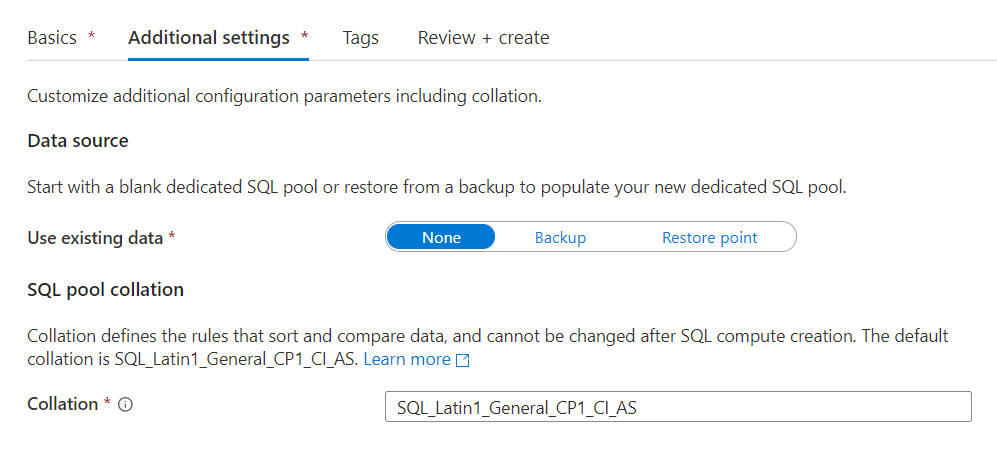

4. Select **Review + create**. Then, select **Create**. Wait for the deployment to complete.

Before completing the next Task, here are multiple security models you need to be aware of in Azure Synapse Analytics.

- **Azure RBAC.** This is the broadest method of access control. Since Synapse Workspaces and dedicated SQL pools are Azure Resource Manager resources, they are also governed by RBAC.

- **Synapse RBAC.** This is an extension of RBAC, specifically for Synapse Workspaces. You can configure this in the **Access control** tab of the **Manage** hub. In the first post, you granted another user the **Synapse Administrator** role scoped over the Workspace. However, it is also possible to scope role assignments over a **Workspace item**, such as an individual Apache Spark pool or Integration runtime.

- **SQL Data Plane Access Control.** Use logins and users to configure access to databases, database tables, and rows. SQL access control is managed through the centralized `master` database, shared among all pools.

## Task 2: Data Plane Access Control

To emphasize the points of the previous Task and earlier posts, we will configure an Azure Active Directory (AAD) user for the dedicated pool user database in this Task.

1. Navigate to the **Data** hub and select **Workspace**. Expand the **mysqlpool** dedicated pool you provisioned in the previous Task.

2. Open the Knowledge center. Select **Browse gallery**. Select **SQL scripts**. Locate a SQL script called **Grant access to a user to a single SQL dedicated database**.

    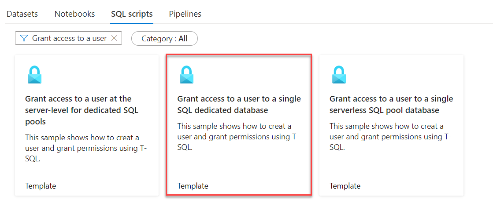

3. Once the preview opens, choose **Select an existing pool**. Then, select the dedicated SQL pool you provisioned earlier and the contained database of the same name.

    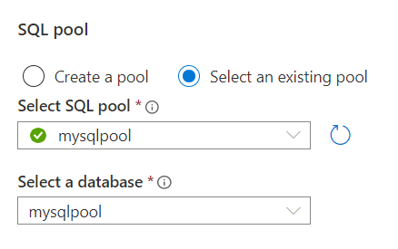

4. The Knowledge center example creates a user at the database-level from an Azure Active Directory login (the `CREATE USER .. FROM EXTERNAL PROVIDER` syntax). This differs from creating a SQL login and a SQL user, where the login exists at the server-level (the `master` database) and the user is created at the database-level. Substitute your Active Directory user account into the script's placeholders and run the SQL script.

    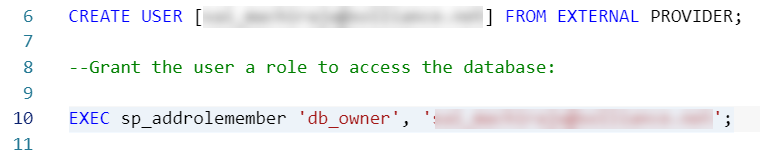

    >**Note**: To do this, you must be the *SQL Active Directory admin* over your workspace. You can configure this using the **Set admin** and **Remove admin** functionalities of the Azure portal.

    

Now that we have learned how to create Active Directory users in dedicated SQL pools, we will use Knowledge center examples to populate the new dedicated SQL pool during the next few Tasks.

## Task 3: Create and Query an External Table

External tables allow data engineers to read and write to data sources stored in Azure Storage Accounts through T-SQL commands. In this Task, you will use the Knowledge center to create external tables from Azure Open Datasets.

1. Load the Knowledge center and select **Use samples immediately**. Select **Create external table with SQL**. Make sure to select the existing dedicated SQL pool that you provisioned.

    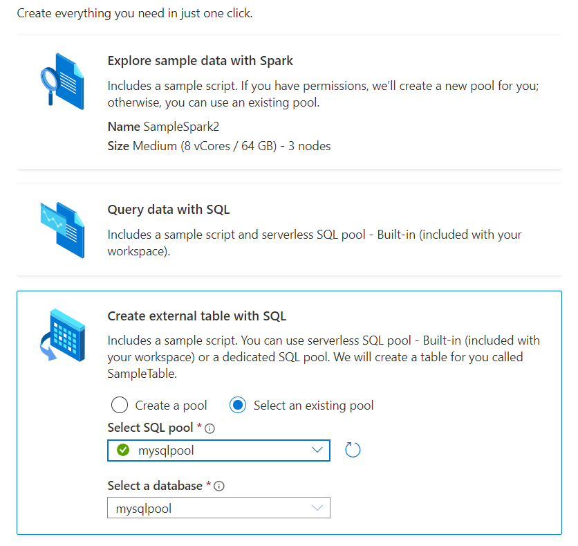

2. Select **Use sample**.

3. Select the first SQL block. The `CREATE EXTERNAL FILE FORMAT` SQL statement defines data stored in Azure Data Lake Storage. In this case, it creates a new file format called `SynapseParquetFormat` that references Parquet files. Run the selection.

    ```sql
    IF NOT EXISTS (SELECT * FROM sys.external_file_formats WHERE name = 'SynapseParquetFormat')
        CREATE EXTERNAL FILE FORMAT [SynapseParquetFormat]
        WITH ( FORMAT_TYPE = PARQUET)
    GO
    ```

4. Select and run the next SQL block. The `CREATE EXTERNAL DATA SOURCE` command provides the connection information for a storage account. In this case, it references the Azure Open Datasets storage account.

    ```sql
    IF NOT EXISTS (SELECT * FROM sys.external_data_sources WHERE name = 'nyctlc_azureopendatastorage_blob_core_windows_net')
        CREATE EXTERNAL DATA SOURCE [nyctlc_azureopendatastorage_blob_core_windows_net]
        WITH (
            LOCATION = 'wasbs://nyctlc@azureopendatastorage.blob.core.windows.net',
            TYPE     = HADOOP
        )
    GO
    ```

5. The `CREATE EXTERNAL TABLE` statement creates a SQL table with the given columns, populated from a location in the `DATA_SOURCE` parameter of the `WITH` clause. Select and run the `CREATE EXTERNAL TABLE` statement.

6. Lastly, query the new external table. Observe the following result set.

    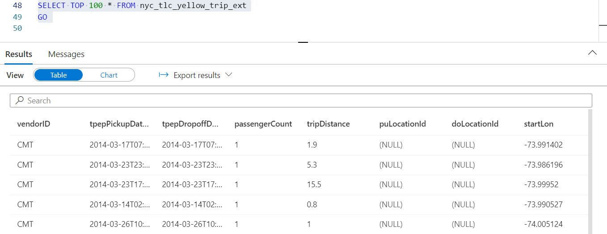

This example shows one method of producing an external table. You can also use CETAS (`CREATE EXTERNAL TABLE AS SELECT`) to generate an external table to write the results of a query to a Data Lake or Blob Storage account.

## Task 4: Load Data using the COPY Statement

In this Task, you will create standard dedicated SQL pool tables and populate them from Azure Open Datasets through the `COPY` statement.

1. In the Knowledge center, select **Browse gallery**. Select **SQL scripts**. Search for a SQL script titled **Load the New York Taxicab dataset**.

    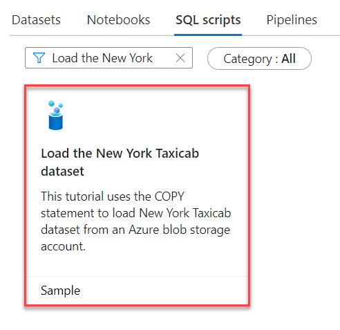

2. Select the existing pool you provisioned for the sample. Then, select **Open script**.

3. With the `COPY` T-SQL statement, first create the target tables, and then use the `COPY` statement to load data from a specified location. Dedicated SQL pool tables allow developers to choose a distribution scheme and an indexing type.

    ```sql
    WITH
    (
        DISTRIBUTION = ROUND_ROBIN,
        CLUSTERED COLUMNSTORE INDEX
    )
    ```

    All tables in this SQL file use even *round-robin* distribution to maximize data loading performance. Moreover, the tables are represnted using a *clustered columnstore index*, which maximizes compression and improves query performance. *Heap* tables have the greatest insert performance.

4. Starting from line 149, observe the `COPY` statement. It simply requires the target table, the data source, and parser options.

    ```sql
    /* Load the data into your data warehouse */
    COPY INTO [dbo].[Date]
    FROM 'https://nytaxiblob.blob.core.windows.net/2013/Date'
    WITH
    (
        FILE_TYPE = 'CSV',
        FIELDTERMINATOR = ',',
        FIELDQUOTE = ''
    )
    OPTION (LABEL = 'COPY : Load [dbo].[Date] - Taxi dataset');
    ```

    Note that the `OPTION` clause specifies a `LABEL`. This is useful to track the execution of the `COPY` statement.

5. Run all statements in the SQL file. Observe the result set once the query completes.

    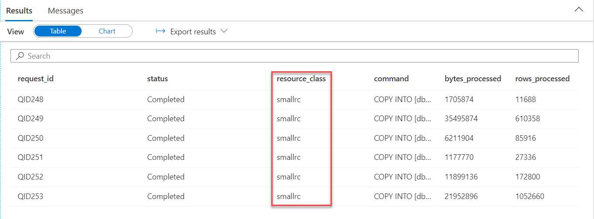

    In particular, observe the `resource_class` column. Resource classes define compute limits for concurrent queries. A smaller resource class correlates with the ability to run more queries concurrently.

    A common scenario is to create a database user for loading data. This user can be given access to a majority of the dedicated pool's resources. While this decreases the supported concurrency, it is useful for loading jobs that run at times of reduced consumer demand, such as night. See [this](https://docs.microsoft.com/azure/synapse-analytics/sql-data-warehouse/sql-data-warehouse-workload-management-portal-monitor) document for more information.

In the previous Task, we created an external table which references data stored in another location (for this post, the Azure Open Datasets storage account). In this Task, we created a table which stores data within the dedicated SQL pool's managed storage.

## Task 5: Result Set Caching

In BI workloads, concurrent users refresh dashboards to obtain an updated view of their data to guide business decisions. Since even a single visual may require multiple SQL queries, result set caching greatly improves the performance of reporting tools and improves the experience for consumers of the BI dashboard.

If the dedicated SQL pool receives a query identical to a query it recently executed, and the underlying data has not changed, then it will immediately return a result set. It is on by default and requires no user management.

1. In the Knowledge center, select **Browse gallery**. Navigate to **SQL scripts**, and select the **Use result set caching in Synapse Pool** script.

2. Choose the existing dedicated SQL pool and select **Open script**.

3. Observe the ability to disable result set caching at the database-level or the session-level.

    ```sql
    ALTER DATABASE [database_name]
    SET RESULT_SET_CACHING ON;

    -- Turn ON/OFF result set caching for a session
    SET RESULT_SET_CACHING { ON | OFF };
    ```

4. Observe the comments in the remainder of the script. We will not execute it, as disabling result set caching is only useful for testing performance. For example, if you are trying to optimize a query used in your BI solution, disable result set caching during development to avoid the bias of caching on your performance measurements.

## Task 6: Dynamic Data Masking 

Dynamic Data Masking hides data that a user is unauthorized to see, such as an email address, phone number, or Social Security number. In this Task, you will learn how to configure Dynamic Data Masking.

1. Navigate to the SQL scripts section of the Knowledge center. Select the **Dynamic Data Masking for dedicated SQL pools** SQL script.

2. Select the existing pool you provisioned and select **Open script**.

3. Select and run lines 1-6. The T-SQL code creates a table, `Membership`. The columns `FirstName`, `Phone`, and `Email` are masked with a masking function to obscure column data for unauthorized users.

    ```sql
    CREATE TABLE Membership
    (MemberID int IDENTITY,
    FirstName varchar(100) MASKED WITH (FUNCTION = 'partial(1,"XXXXXXX",0)') NULL,
    LastName varchar(100) NOT NULL,
    Phone varchar(12) MASKED WITH (FUNCTION = 'default()') NULL,
    Email varchar(100) MASKED WITH (FUNCTION = 'email()') NULL);
    ```

    Synapse supports custom masking functions (with the `partial()` keyword) and a multitude of built-in masking functions (such as `email()`).

4. Select and run lines 9-12. Note that you do not see masking applied, as you are an administrative user.

    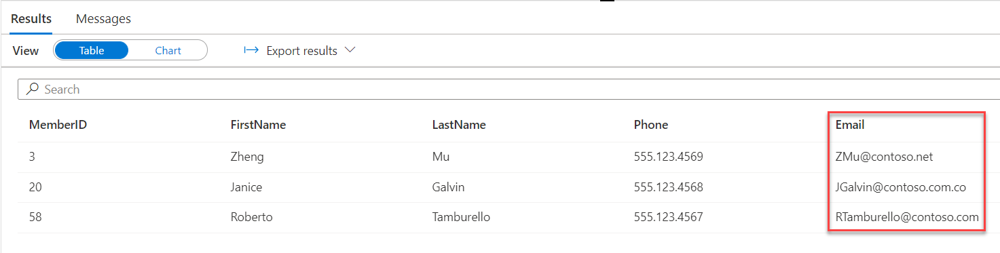

5. Select and run lines 15-16, which create a new user, `TestUser`. This new user can only query the `Membership` table.

6. Select and run lines 19-21, which query the `Membership` table as `TestUser`. Here, masking is applied to all three columns.

    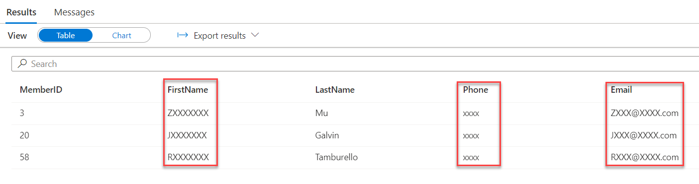

7. On lines 32-35, by granting the `UNMASK` permission to `TestUser`, and executing the query again, masking is not applied.

Note that Dynamic Data Masking does not change data in the database; it just obscures data in result sets that unauthorized users cannot see. This reduces the impact on consuming applications. Read more about Dynamic Data Masking [here.](https://docs.microsoft.com/sql/relational-databases/security/dynamic-data-masking)

## Task 7: Row-Level Security

In the previous task, we demonstrated Dynamic Data Masking, a data obfuscation technique transparent to end users. It couples well with Row-Level Security, which dictates the rows of a result set that can be displayed to a given user.

This is useful for BI scenarios, as reports only need to query one table, but can still restrict the result sets of queries over the table. The alternative is writing separate views for each user, which becomes difficult to manage.

1. Navigate to the SQL scripts section of the Knowledge center. Select the **Row-Level Security for dedicated SQL pools** SQL script.

2. Select the existing pool you provisioned and select **Open script**.

3. Run lines 2-4 to create three different users needed for the scenario. The `Manager` user is more privileged than the two other users, who can only view the rows in the `Sales` table associated with them.

4. Run lines 7-13 to create the new `Sales` table. Then, run lines 16-23 to insert six records into the `Sales` table and visualize the output.

5. Run lines 26-28 to ensure than the three users have sufficient permissions to query the `Sales` table.

6. Run lines 33-34 to create a new schema, `Security`, which stores security predicates and filters. This is a best-practice technique to manage security controls.

7. Run lines 37-43 to create the T-SQL function (`fn_securitypredicate`)  that determines whether or not a user can view a given row. The `Manager` can see all rows, while the `Sales` users can only see the rows that reference their user name in the `SalesRep` field.

    >**Note**: This T-SQL function is located in the `Security` schema.

8. Run lines 45-48 to create the security policy that applies `fn_securitypredicate` on a row-wise basis to control access.

9. The last step for the Row-Level Security setup is granting the `SELECT` permission over the `fn_securitypredicate` function to the three users. Select and run lines 51-53.

10. Run lines 56-58 to observe RLS. When executing as the user `Sales1`, only rows associated with the `Sales1` user display. Observe the same behavior for `Sales2`.

    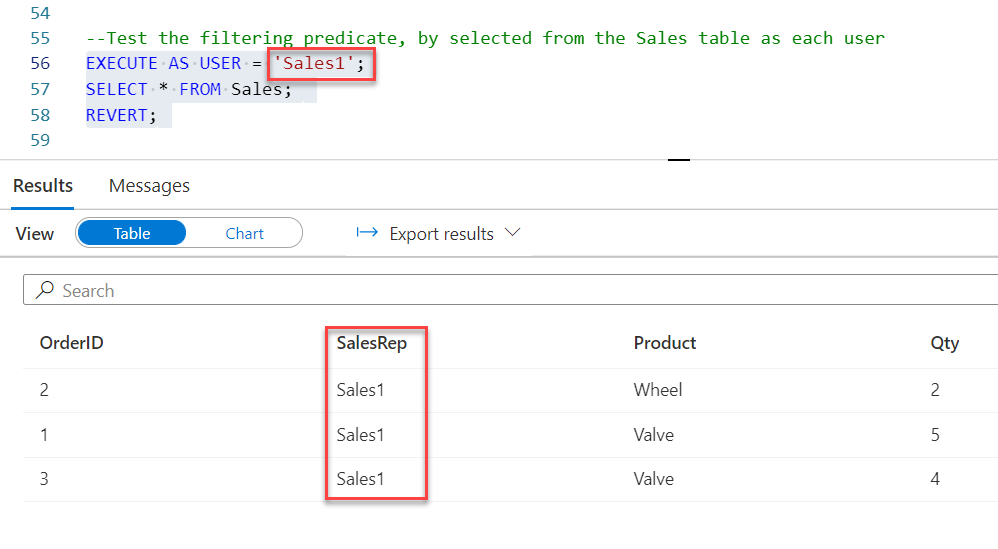

11. However, executing the query as the `Manager` user (lines 64-66) demonstrates the records associated with `Sales1` and `Sales2`.

    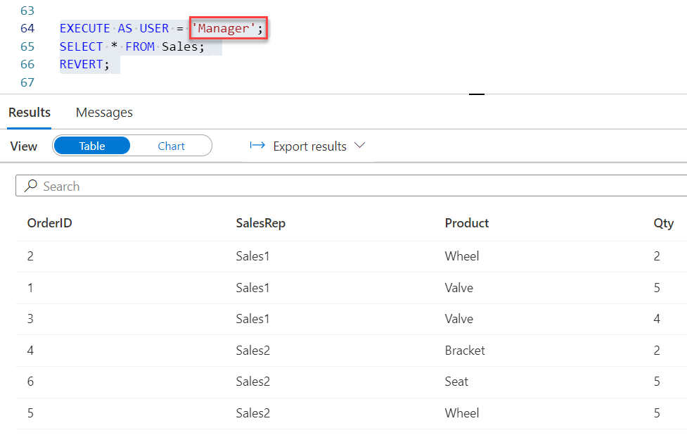

12. Lines 69-70 disable the RLS policy. This means that `Sales1`, `Sales2`, and `Manager` can view all records.

    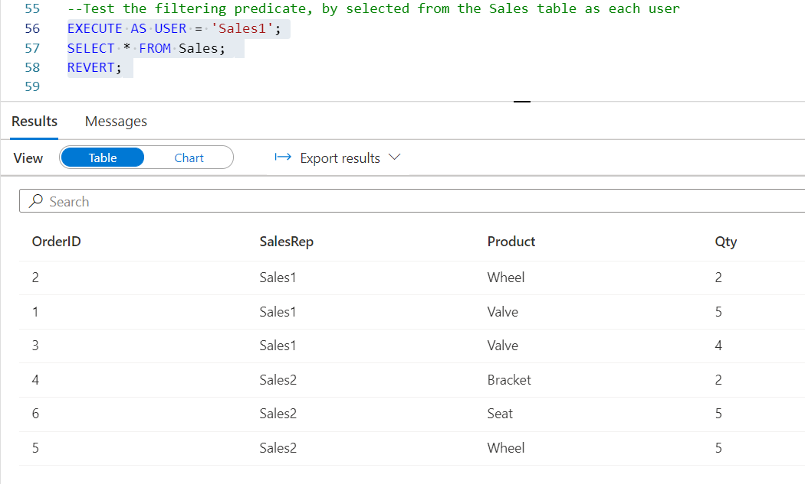

## Task 8: Creating a Power BI Dashboard Linked Service

As mentioned in previous posts, linked services store connection information for external services interfaced with a Synapse Workspace. In this example, you will connect a Power BI Workspace to your Synapse Workspace.

1. Navigate to the **Manage** hub and select **Linked services**.

2. Select **+ New** and select **Connect to Power BI**.

    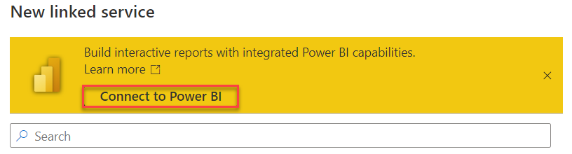

3. On the **New linked service (Power BI)** page, keep the **Name** at its default value. Then, select your Power BI tenant and the Workspace within your tenant where you plan to locate your BI reports. Select **Create** once you finish.

    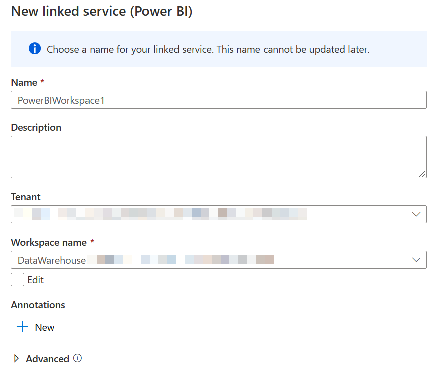

4. Select **Publish all** at the top of the page. This ensures that the linked service is created.

## Task 9: Creating a Power BI Dashboard in Power BI Desktop

In this Task, you will learn how to develop a Power BI report from a Synapse dedicated SQL pool. You will then observe the powerful Synapse Workspace integration with Power BI, which provides a rich authoring experience for BI developers.

1. Launch Power BI Desktop and select **Get data**. Search for **Azure Synapse Analytics (SQL DW)**. Select **Continue**.

2. Provide the Workspace **Dedicated SQL endpoint** and **Database** (which has the same name as the dedicated SQL pool you provisioned). Also, ensure that you use **DirectQuery** as the **Data Connectivity mode**. DirectQuery passes queries directly to the dedicated SQL pool, taking advantage of the optimizations discussed earlier. Select **OK**.

    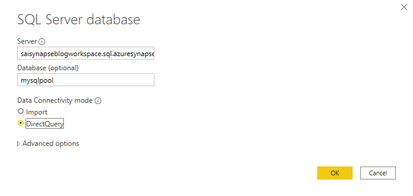

    >**Note**: To find the Workspace Dedicated SQL endpoint, navigate to the Azure portal, and select your Synapse Workspace resource. You will see the endpoint URL on the **Overview** page.

3. You now need to authenticate with the dedicated SQL pool. Use your **Microsoft account**, as it has been configured as an AAD user of the dedicated SQL pool. Select **Connect**.

    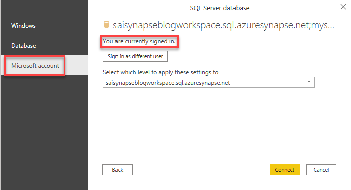

4. In the **Navigator** window, select multiple tables. Then, select **Load**.

    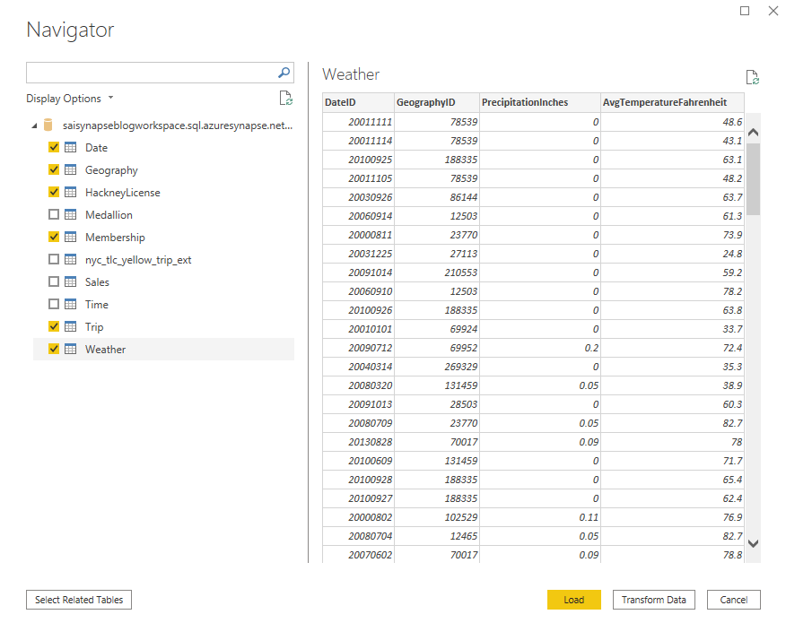

    >**Note**: Since we chose the DirectQuery connection model, Power BI is not actually loading data after you select the **Load** button. It is simply detecting the schema and making model connections.

5. Add a simple visualization to the Power BI report. This is a simple bar plot that demonstrates annual revenue by year. [Here](SampleNotebook.pbix) is the sample report. Note that you may need to adjust connection information for your SQL pool.

    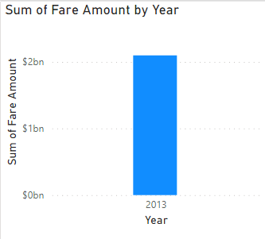

6. Select **Publish** in the toolbar. Select the same workspace you used to configure the Power BI linked service.

    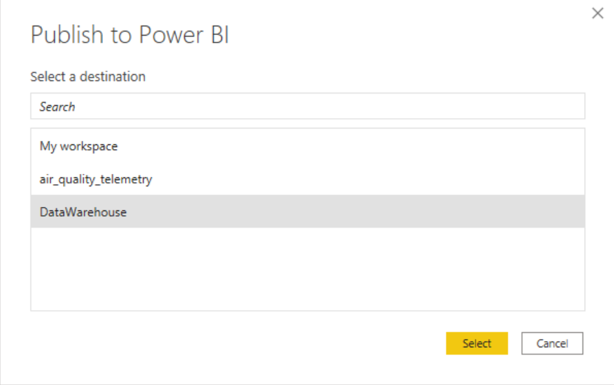

7. Wait for the publishing operation to complete.

    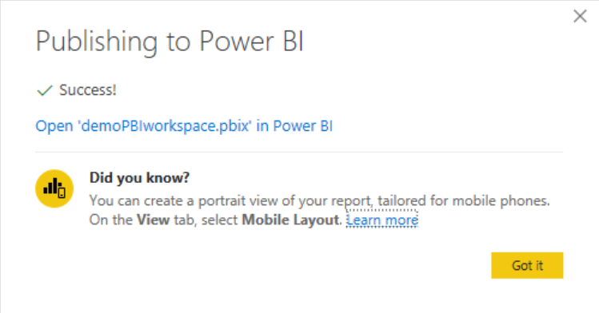

8. To validate the integration, navigate to the **Develop** hub in the Synapse Workspace. Expand **Power BI** and the Power BI Workspace you linked. Observe the published report in the list.

    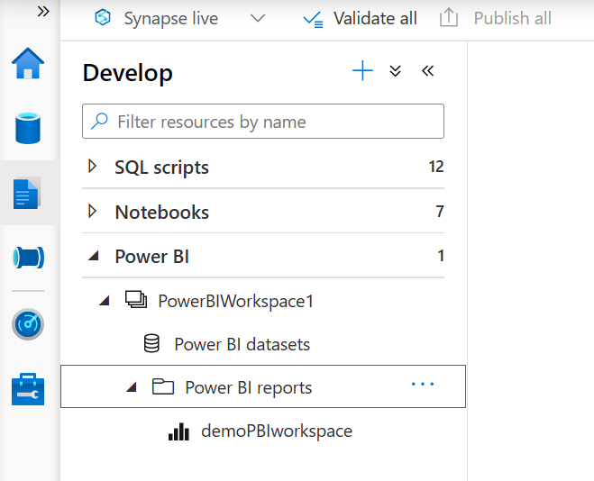

    Once the report opens, you have a full editing experience. Once you complete making any edits, select **File** and **Save** to persist your changes.

## Conclusion

This blog post concludes the *Let's Build Together* series. This post emphasizes how Azure Synapse Analytics dedicated SQL pools fit into your organization's BI stack. During this post, you have learned best-practices techniques to secure your dedicated SQL pool, manage access, create tables, and integrate pools with reporting tools. As you adopt Azure Synapse Analytics in your organization, consult the plethora of resources Microsoft has produced to demonstrate common usage scenarios.