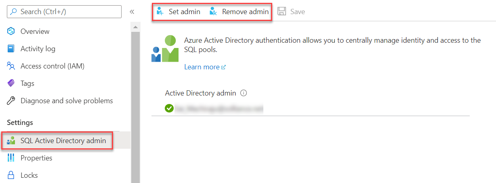

# Episode 6: Optimize Data Warehouse Workloads for BI and Reporting

## Table of Contents

## Introduction

## Task 1: Creating a Dedicated SQL Pool

While you have been exposed to provisioning dedicated SQL pools previously, in this Task, we will provide additional detail regarding this distributed SQL component of Azure Synapse Analytics.

1. Navigate to the **Manage** hub and select **SQL pools**. Select **+ New**.

2. In the **Basics** tab of the **Create dedicated SQL pool** window, provide a name of your choice and set the performance level to **DW100c**. We will be working with a small amount of data, so this provisioned capacity is sufficient.

    

3. Select **Next: Additional settings >**. Observe that you can pre-populate the SQL pool from a **Backup** or a **Restore point**. This is useful to build separate development and production environments.

    

4. Select **Review + create**. Then, select **Create**. Wait for the deployment to complete.

Before completing the next Task, here are multiple security models you need to be aware of in Azure Synapse Analytics.

- **Azure RBAC.** This is the broadest method of access control. Since Synapse Workspaces and dedicated SQL pools are Azure Resource Manager resources, they are also governed by RBAC.

- **Synapse RBAC.** This is an extension of RBAC, specifically for Synapse Workspaces. You can configure this in the **Access control** tab of the **Manage** hub. In the first post, you granted another user the **Synapse Administrator** role scoped over the Workspace. However, it is also possible to scope role assignments over a **Workspace item**, such as an individual Apache Spark pool or Integration runtime.

- **SQL Data Plane Access Control.** Use logins and users to configure access to databases, database tables, and rows. SQL access control is managed through the centralized `master` database, shared among all pools.

## Task 2: Data Plane Access Control

1. Navigate to the **Data** hub and select **Workspace**. Expand the **mysqlpool** dedicated pool you provisioned in the previous Task.

2. Open the Knowledge center. Select **Browse gallery**. Select **SQL scripts**. Locate a SQL script called **Grant access to a user to a single SQL dedicated database**.

    

3. Once the preview opens, choose **Select an existing pool**. Then, select the dedicated SQL pool you provisioned earlier and the contained database of the same name.

    

4. The Knowledge center example creates a user at the database-level from an Azure Active Directory login (the `CREATE USER .. FROM EXTERNAL PROVIDER` syntax). This differs from creating a SQL login and a SQL user, where the login exists at the server-level (the `master` database) and the user is created at the database-level. Substitute your Active Directory user account into the script's placeholders and run the SQL script.

    

    >**Note**: To do this, you must be the *SQL Active Directory admin* over your workspace. You can configure this using the **Set admin** and **Remove admin** functionalities of the Azure portal.

    

Now that we have learned how to create Active Directory users in dedicated SQL pools, we will use Knowledge center examples to populate the new dedicated SQL pool during the next few Tasks.

## Task 3: Create and Query an External Table

1. Load the Knowledge center and select **Use samples immediately**. Select **Create external table with SQL**. Make sure to select the existing dedicated SQL pool that you provisioned.

    

2. Select **Use sample**.

3. Select the first SQL block. The `CREATE EXTERNAL FILE FORMAT` SQL statement defines data stored in Azure Data Lake Storage. In this case, it creates a new file format called `SynapseParquetFormat` that references Parquet files. Run the selection.

    ```sql
    IF NOT EXISTS (SELECT * FROM sys.external_file_formats WHERE name = 'SynapseParquetFormat')
        CREATE EXTERNAL FILE FORMAT [SynapseParquetFormat]
        WITH ( FORMAT_TYPE = PARQUET)
    GO
    ```

4. Select and run the next SQL block. The `CREATE EXTERNAL DATA SOURCE` command provides the connection information for a storage account. In this case, it references the Azure Open Datasets storage account.

    ```sql
    IF NOT EXISTS (SELECT * FROM sys.external_data_sources WHERE name = 'nyctlc_azureopendatastorage_blob_core_windows_net')
        CREATE EXTERNAL DATA SOURCE [nyctlc_azureopendatastorage_blob_core_windows_net]
        WITH (
            LOCATION = 'wasbs://nyctlc@azureopendatastorage.blob.core.windows.net',
            TYPE     = HADOOP
        )
    GO
    ```

5. The `CREATE EXTERNAL TABLE` statement creates a SQL table with the given columns, populated from a location in the `DATA_SOURCE` parameter of the `WITH` clause. Select and run the `CREATE EXTERNAL TABLE` statement.

6. Lastly, query the new external table. Observe the following result set.

    

This example shows one method of producing an external table. You can also use CETAS (`CREATE EXTERNAL TABLE AS SELECT`) to generate an external table to write the results of a query to a Data Lake or Blob Storage account.

## Task 4: Load Data using the COPY Statement

1. In the Knowledge center, select **Browse gallery**. Select **SQL scripts**. Search for a SQL script titled **Load the New York Taxicab dataset**.

    

2. Select the existing pool you provisioned for the sample. Then, select **Open script**.

3. With the `COPY` T-SQL statement, first create the target tables, and then use the `COPY` statement to load data from a specified location. Dedicated SQL pool tables allow developers to choose a distribution scheme and an indexing type.

    ```sql
    WITH
    (
        DISTRIBUTION = ROUND_ROBIN,
        CLUSTERED COLUMNSTORE INDEX
    )
    ```

    All tables in this SQL file use even *round-robin* distribution to maximize data loading performance. Moreover, the tables are represnted using a *clustered columnstore index*, which maximizes compression and improves query performance. *Heap* tables have the greatest insert performance.

4. Starting from line 149, observe the `COPY` statement. It simply requires the target table, the data source, and parser options.

    ```sql
    /* Load the data into your data warehouse */
    COPY INTO [dbo].[Date]
    FROM 'https://nytaxiblob.blob.core.windows.net/2013/Date'
    WITH
    (
        FILE_TYPE = 'CSV',
        FIELDTERMINATOR = ',',
        FIELDQUOTE = ''
    )
    OPTION (LABEL = 'COPY : Load [dbo].[Date] - Taxi dataset');
    ```

    Note that the `OPTION` clause specifies a `LABEL`. This is useful to track the execution of the `COPY` statement.

5. Run all statements in the SQL file. Observe the result set once the query completes.

    

    In particular, observe the `resource_class` column. Resource classes define compute limits for concurrent queries. A smaller resource class correlates with the ability to run more queries concurrently.

    A common scenario is to create a database user for loading data. This user can be given access to a majority of the dedicated pool's resources. While this decreases the supported concurrency, it is useful for loading jobs that run at times of reduced consumer demand, such as night. See [this](https://docs.microsoft.com/azure/synapse-analytics/sql-data-warehouse/sql-data-warehouse-workload-management-portal-monitor) document for more information.

In the previous Task, we created an external table which references data stored in another location (for this post, the Azure Open Datasets storage account). In this Task, we created a table which stores data within the dedicated SQL pool's managed storage.

## Task 5: Result Set Caching

In BI workloads, concurrent users refresh dashboards to obtain an updated view of their data to guide business decisions. Since even a single visual may require multiple SQL queries, result set caching greatly improves the performance of reporting tools and improves the experience for consumers of the BI dashboard.

If the dedicated SQL pool receives a query identical to a query it recently executed, and the underlying data has not changed, then it will immediately return a result set. It is on by default and requires no user management.

1. In the Knowledge center, select **Browse gallery**. Navigate to **SQL scripts**, and select the **Use result set caching in Synapse Pool** script.

2. Choose the existing dedicated SQL pool and select **Open script**.

3. Observe the ability to disable result set caching at the database-level or the session-level.

    ```sql
    ALTER DATABASE [database_name]
    SET RESULT_SET_CACHING ON;

    -- Turn ON/OFF result set caching for a session
    SET RESULT_SET_CACHING { ON | OFF };
    ```

4. Observe the comments in the remainder of the script. We will not execute it, as disabling result set caching is only useful for testing performance. For example, if you are trying to optimize a query used in your BI solution, disable result set caching during development to avoid the bias of caching on your performance measurements.

## Task 6: 